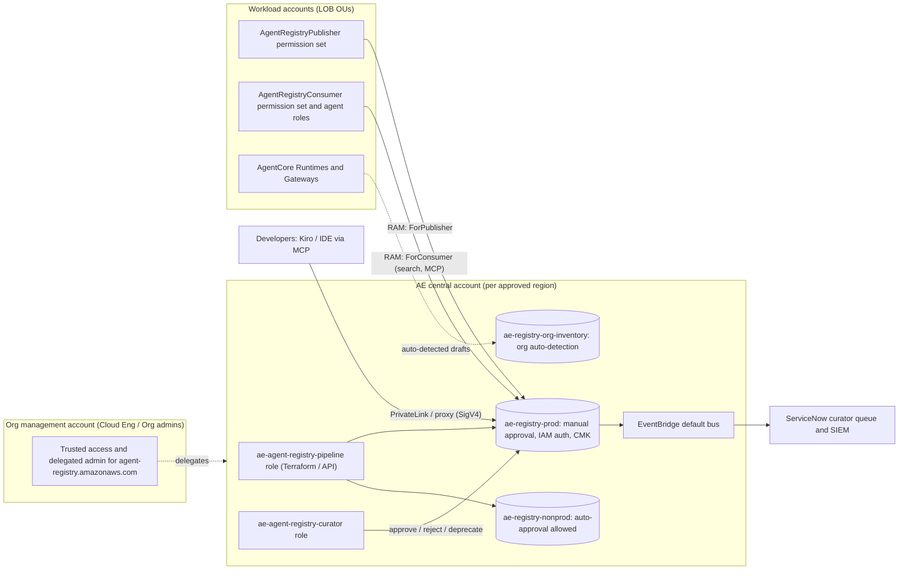

# Service Evaluation: AWS Agent Registry

| | |
|---|---|
| **Service** | AWS Agent Registry (IAM namespace `agent-registry`) |
| **Evaluating team** | Cloud Engineering |
| **Partner team** | Agentic Engineering (AE), which owns AgentCore governance and the central account |
| **Operating model assessed** | Centralized: only the AE central account owns registries; workload accounts publish and consume through AWS RAM |
| **Control mechanisms in scope** | SCP, RCP, IAM / permission sets, Sentinel (HCP Terraform / TFE), AWS Config |
| **Status** | DRAFT v0.1, for review by AE, InfoSec, and Data/Privacy |
| **Date** | 2026-09-10 |

> Account IDs, org IDs, role names, tag keys, hostnames and regions in the code are **placeholders**. `111111111111` = AE central account, `o-exampleorgid` = the bank's Organization. Replace them with the values from the bank's standards before use.

---

## 1. Executive summary

**Recommended disposition: conditionally approve** AWS Agent Registry for the centralized AE model.

The service fits the model well. Registries are regional resources that one account owns and shares through AWS RAM. RAM's managed permissions separate consumers, publishers and admins cleanly. The RAM permission given to publishers leaves out approval (`UpdateRegistryRecordStatus`). That means the approval gate can stay with AE curators while LOB teams publish their own records.

We can build strong **preventive** controls from SCPs, IAM, RAM and Sentinel. **Detective** coverage is weak by default: there is no AWS Config recording, no managed Config rules, and no Security Hub or Control Tower controls. This evaluation therefore adds a custom Config rule and EventBridge detections.

**Conditions before production use**

| # | Condition | Blocking? |
|---|---|---|
| C1 | **Data residency sign-off.** Semantic search uses cross-region inference that *"might be processed in any commercial AWS Region"*. There is no documented opt-out, and CloudTrail doesn't record which Region processed the request. Either get an exception or confirmation from the AWS account team, or approve a content standard that keeps sensitive data out of records (ARO-03). | **Yes** |
| C2 | **Compliance scope confirmed.** Amazon Bedrock AgentCore is listed for SOC, PCI DSS, FedRAMP and HIPAA, but "Agent Registry" is not named and now runs in its own namespace. Get confirmation through AWS Artifact or the account team. | **Yes** |
| C3 | Preventive guardrails (SCPs ARP-01 to ARP-08 and ARP-10; ARP-09 is optional) deployed **before** any RAM share is created. | **Yes** |
| C4 | Decide on encryption: customer managed KMS key (CMK) or the AWS owned key. A CMK can only be set through the API or CLI at creation; CloudFormation and Terraform can't set it. | Yes (decision) |
| C5 | Preview usage inventoried and migrated. The `bedrock-agentcore` registry namespace **shuts down on 2026-09-17**, and data left in it is lost. | Time-critical |

**Top findings**

| ID | Finding | Rating |
|---|---|---|
| F-01 | Semantic search can process queries and results in any commercial AWS Region. There is no opt-out, and the Region isn't logged. | High |
| F-02 | Agent Registry isn't explicitly named in AWS compliance scope lists. | High (until confirmed) |
| F-03 | No AWS Config recording or managed rules, and no Security Hub or Control Tower controls. Detection has to be custom. | Medium |
| F-04 | No IAM condition keys for authorizer type, auto-approval, KMS key, record type or sync URL. Configuration can't be enforced with SCPs; it needs Sentinel plus detective checks. | Medium |
| F-05 | The CMK is optional, can only be set at creation (API/CLI only), and covers descriptors and the search index only. Names and descriptions stay under the AWS owned key. | Medium |
| F-06 | JWT-authorized registries let data-plane callers in with **no IAM identity**. SCPs and IAM don't apply to them, and VPC endpoint policies can only deny them. | Medium |
| F-07 | The registry is a catalog, **not a runtime enforcement point**. Approving a record doesn't stop an agent from calling an unregistered MCP server. | Medium (design) |
| F-08 | URL sync only reaches **public IPs**. Internal MCP servers can't be synced, so their records are static and can go stale. | Low / Medium |
| F-09 | The AWS managed policy `AgentRegistryFullAccess` grants `secretsmanager:GetSecretValue` on `*` and `iam:PassRole` on all roles. | Medium |
| F-10 | IaC is immature. The Terraform `aws` registry resource shipped 2026-09-09, and records exist only in `awscc`. In the `aws` provider, any change to `discovery_configuration` **replaces** the registry, which deletes all of its records. | Medium |

---

## 2. What the service is (and isn't)

AWS Agent Registry is a private, governed catalog of **agents (A2A agent cards), MCP servers and their tools, skills, and custom resources**. Publishers create records that start as `DRAFT`, then submit them (`PENDING_APPROVAL`). A curator moves each record to `APPROVED`, `REJECTED` or `DEPRECATED`. Consumers only see approved records, which they can find in three ways:

- Hybrid semantic and keyword search
- Browse (list and get)
- A built-in **MCP endpoint** that IDEs such as Kiro, and agents, can query

Records can pull live metadata from an MCP or A2A URL (URL sync). An organization-scoped registry can **automatically detect** AgentCore Runtimes and Gateways across AWS Organizations.

**It is not:**

- A runtime gateway. It doesn't proxy or authorize tool calls. That job belongs to AgentCore Gateway, AgentCore Policy and network egress controls, which AE already owns.
- A secrets store. Credentials for URL sync live in AgentCore Identity and Secrets Manager.
- A replacement for the CMDB. Records should *reference* the CMDB application ID through the mandatory `app-id` tag.

---

## 3. Service facts at a glance

| Attribute | Value |
|---|---|
| Namespace / SDK | IAM prefix `agent-registry`. Control plane: `agent-registry-control` (15 operations), endpoint `agent-registry-control.{region}.api.aws`. Data plane: `agent-registry` (3 operations plus the MCP endpoint), endpoint `agent-registry.{region}.api.aws` |
| Lifecycle | New namespace launched 2026-08-06; GA 2026-08-31. The preview `bedrock-agentcore` registry namespace shuts down **2026-09-17**, and its data is deleted |
| Regions | us-east-1, us-west-2, eu-west-1, ap-northeast-1, ap-southeast-2. **Not** available in us-east-2 or GovCloud |
| IAM resource types | `registry` (`arn:aws:agent-registry:{region}:{acct}:registry/{id}`) and `registry-record` (`…/registry/{id}/record/{rid}`) |
| IAM actions | 22 in total (Appendix A). There is no "Permissions management" access level |
| Service condition keys | `agent-registry:RecordCreatorAccount`, `agent-registry:RecordSourceAccount`, plus `aws:RequestTag`, `aws:ResourceTag` and `aws:TagKeys` |
| Auth: control plane | Always IAM (SigV4) |
| Auth: data plane | Chosen per registry at creation and **immutable**: `AWS_IAM` (default) or `CUSTOM_JWT` (OIDC discovery URL plus audience, client, scope or claim rules) |
| Resource-based policy | Yes, on `registry`, managed through AWS RAM |
| Cross-account | RAM resource type `agent-registry:Registry`. Managed permissions: `…ReadOnly` (default), `…ForConsumer`, `…ForPublisher`, `…ForAdmin`. Sharing outside the Organization is **possible** |
| Service-linked role | `AWSServiceRoleForAgentRegistry`. Needed by `CreateRegistry`, a CMK, and auto-detection. It creates service-linked AWS Config recorders |
| SCP support | Yes, for IAM principals. It doesn't cover JWT data-plane callers |
| RCP support | **No.** Agent Registry isn't on the RCP-supported services list |
| Encryption at rest | AWS owned key by default. A symmetric, single-Region CMK can be set at creation through the API or CLI only, and can't be changed afterwards |
| Private connectivity | PrivateLink for both planes: `com.amazonaws.{region}.agent-registry-control` and `com.amazonaws.{region}.agent-registry`. VPC endpoint policies are supported. FIPS endpoints aren't documented |
| Logging | CloudTrail management events by default. **Data events** (search, list/get discoverable, `InvokeRegistryMcp`) must be opted in (`resources.type = AWS::AgentRegistry::Registry`) |
| Events | EventBridge source `aws.agent-registry` on the owning account's default bus: 7 registry and 5 record detail types (Appendix C) |
| AWS Config | **Not recorded.** No managed rules |
| Security Hub / Control Tower | No AgentRegistry controls. Controls BedrockAgentCore.1 to .7 cover Runtime, Gateway and Memory |
| CloudFormation | `AWS::AgentRegistry::Registry` and `AWS::AgentRegistry::RegistryRecord`. Neither can set a KMS key or auto-detection |
| Terraform | `aws_agentregistry_registry` (hashicorp/aws ≥ 6.64.0) can't set a KMS key or auto-detection. Records exist only as `awscc_agentregistry_registry_record` (awscc ≥ 1.98.0). `aws_bedrockagentcore_registry` is deprecated |
| Quotas | 5 registries per account per Region (adjustable). 5 TPS for registry operations and for creating or updating records; 10 TPS for other record operations and the data plane. Search returns up to 20 results and covers one registry per query |
| Pricing | 5,000 records free per month, then $0.40 per 1,000. Search: 1M calls free, then $0.02 per 1,000. List and Get: 2M calls free, then $0.004 per 1,000 |
| Compliance | "Amazon Bedrock AgentCore" is in scope for SOC 1/2/3, PCI DSS, FedRAMP and HIPAA eligibility. Agent Registry is **not named**; see C2 |

---

## 4. Target operating model: centralized in the AE account

### 4.1 Topology



### 4.2 Registry layout in the AE account

These are recommended starting points. They fit within the default quota of 5 registries per account per Region.

| Registry | Purpose | Authorizer | Approval | Encryption | Shared to |
|---|---|---|---|---|---|
| `ae-registry-prod` | Curated catalog for production agents and developers | `AWS_IAM` | Manual (`auto_approval_rules` empty) | CMK (if C4 = CMK) | Consumer: all workload OUs. Publisher: builder OUs |
| `ae-registry-nonprod` | Dev/test publishing and experimentation | `AWS_IAM` | `APPROVE_ALL` allowed (tag `environment=dev`) | CMK or AWS owned | Consumer and Publisher: non-prod OUs only |
| `ae-registry-org-inventory` | Organization-wide auto-detection of AgentCore Runtimes and Gateways (at most one per Region) | `AWS_IAM` | Manual | CMK (the SLR must exist in the management account and the AE account) | AE and InfoSec only |

**Prerequisite for auto-detection.** The Org management account must enable trusted access for `agent-registry.amazonaws.com` and register the AE account as delegated administrator. `AWSServiceRoleForAgentRegistry` must exist in the management account. Auto-detected records can't be deleted while auto-detection is enabled.

### 4.3 Roles and where they live

Cross-account access needs **both** layers to allow an action: the RAM managed permission, which is the resource side, and the caller's IAM policy.

| AWS persona | Bank role | Account | Mechanism |
|---|---|---|---|
| Administrator | `ae-agent-registry-pipeline` (CI/CD) and `ae-breakglass` | AE | IAM role ARI-01. Only principal allowed to create, update or delete registries (SCP ARP-01) |
| Curator / approver | `ae-agent-registry-curator` (AE staff) | AE | IAM role ARI-02, with a separation-of-duties deny on publishing. Only principal allowed to call `UpdateRegistryRecordStatus` (ARP-02) |
| Publisher | LOB agent and MCP builders | Workload | Permission set ARI-03 plus RAM `AWSRAMPermissionAgentRegistryForPublisher`. Can only change records **its own account created** (`RecordCreatorAccount`) |
| Consumer | Developers, agent runtime roles, IDE users | Workload | Permission set or role ARI-04 plus RAM `AWSRAMPermissionAgentRegistryForConsumer` |
| Auditor | InfoSec / Audit | AE (read-only) | `AgentRegistryReadOnlyAccess` (note: it includes `InvokeRegistryMcp`) |

`AWSRAMPermissionAgentRegistryForAdmin` is **never** shared outside AE (ARI-06).

### 4.4 Publishing and approval flow

1. A publisher in a workload account calls `CreateRegistryRecord` against the **AE registry ARN**, with the mandatory tags (ARP-06). They can use the CLI, SDK, or the `awscc` Terraform resource, which is subject to ARS-04.
2. The publisher calls `SubmitRegistryRecordForApproval`. EventBridge emits `Registry Record State changed to Pending Approval` on the **AE** default bus, and ARD-04 opens a ServiceNow ticket in the curator queue.
3. The curator reviews the record against the checklist (ARO-01) and calls `UpdateRegistryRecordStatus` with `APPROVED` or `REJECTED` and a `statusReason`.
4. Once approved, the record can be discovered through search, browse and the MCP endpoint. If the source URL changes later, a sync creates a new `DRAFT` revision, and the approved revision stays discoverable until the new one is approved.
5. Every quarter, owners recertify their approved records. Stale records are moved to `DEPRECATED` (ARO-02).

### 4.5 RACI

| Activity | Cloud Eng | AE | InfoSec | LOB teams |
|---|---|---|---|---|
| SCPs and RCPs (ARP, ARR) | **R/A** | C | C | I |
| Sentinel policy set (ARS) | **R/A** | C | I | I |
| Config rule and EventBridge detections (ARD) | **R/A** | C | C (SIEM) | I |
| Registry lifecycle, RAM shares, CMK, IAM roles in AE | C | **R/A** | I | I |
| Record curation and recertification (ARO) | I | **R/A** | C | R (owners) |
| Trusted access and delegated admin (management account) | **R** | A | I | – |
| Publishing records | I | C | I | **R/A** |

---

## 5. Security assessment

### 5.1 Identity and access management

- **Small, well-scoped IAM surface.** There are 22 actions and two resource types. `CreateRegistry` and `ListRegistries` are the only actions that can't be scoped to a resource.
- **Control plane is always IAM.** Even JWT registries use SigV4 for `Create*`, `Update*` and `UpdateRegistryRecordStatus`, so SCPs fully govern registry and record management and approval.
- **Few condition keys.** The service-specific keys are `RecordCreatorAccount` and `RecordSourceAccount`, which are evaluated on get, update, delete, submit, status and get-discoverable record calls, but *not* on create, search or list. Tag keys are supported on create and tag operations. **There are no keys for authorizer type, auto-approval, KMS key, record type or sync URL** (F-04). Those settings are enforced in IaC (Sentinel) and checked afterwards (ARD-01).
- **JWT authorizer (F-06).** Data-plane callers with a bearer token have no IAM identity, so SCPs, IAM and permission boundaries don't apply to them. A VPC endpoint policy can only match them with `Principal: "*"` statements. It isn't documented how their identity appears in CloudTrail data events. Recommendation: **use `AWS_IAM` only** for now. IDE users connect through `mcp-proxy-for-aws` with their SSO credentials. JWT can be reconsidered after a PoC shows claim restrictions and audit logging work with the bank IdP.
- **Managed policies (F-09).** `AgentRegistryFullAccess` includes `secretsmanager:GetSecretValue` on `*` and `iam:PassRole` on `arn:aws:iam::*:role/*` (conditioned only on `PassedToService`). SCP ARP-10 blocks attaching it to IAM roles, users and groups in member accounts. Identity Center permission sets are provisioned by a service-linked role that SCPs don't restrict, so the Identity Center permission-set review process must also reject it. `AgentRegistryReadOnlyAccess` includes `InvokeRegistryMcp`, which is acceptable because that call is read-only.
- **Tooling gaps.** IAM Access Analyzer policy generation and last-accessed information aren't supported for `agent-registry`, so access reviews rely on CloudTrail.
- **Documentation conflict.** For IAM-based URL sync, one AWS page gives `iam:PassedToService = bedrock-agentcore.amazonaws.com`, while the service reference and the managed policy use `agent-registry.amazonaws.com`. The publisher permission set (ARI-03) allows both values but only for `agent-registry-sync-*` roles. SCP ARP-07 covers only `agent-registry.amazonaws.com`, because denying `bedrock-agentcore.amazonaws.com` would break AgentCore Runtime and Gateway. If the PoC (T-07) shows that `bedrock-agentcore.amazonaws.com` is evaluated, ARP-07 won't cover URL sync, and ARI-03 becomes the only control.

### 5.2 Data protection

- **Encryption at rest.** The AWS owned key is used by default.
  - A CMK must be symmetric and single-Region. It is set with `encryptionConfiguration.kmsKeyArn` on `CreateRegistry` and **can't be added, changed or removed later**; changing keys means creating a new registry and migrating its records.
  - The CMK covers descriptors (MCP and tool definitions, agent cards, skill content, custom JSON) and the search index. **Registry and record names, descriptions, versions and IDs stay under the AWS owned key.**
  - If the key is disabled, create, get, update and search fail, but list and delete still work.
- **IaC gap (F-05).** `encryptionConfiguration` is **not exposed** in CloudFormation, `aws_agentregistry_registry` (it's commented out in the provider), or `awscc`.
  - If C4 is a CMK, AE creates registries with the API, for example a pipeline step using `aws agent-registry-control create-registry --encryption-configuration …`. Terraform then manages everything else after `terraform import`.
  - Either way, the key can't be enforced as a preventive control. ARD-01 detects registries that lack it.
- **KMS key policy (ARI-07).** Scope the key with `kms:ViaService = agent-registry.{region}.amazonaws.com` and the encryption context `kms:EncryptionContext:aws:agent-registry:registry-arn`. Add `aws:PrincipalOrgID` so RAM consumers can decrypt. The SLR must exist before the registry is created.
- **Content standard (ARO-03).** Record metadata must not contain customer data, PII, secrets or confidential business data. This matters because of cross-region inference (5.3) and because some fields aren't covered by the CMK. The allowed data classification tag values are `public` and `internal`.

### 5.3 Data residency: cross-region inference (F-01)

AWS documentation states: *"input prompts and output results might be processed in any commercial AWS Region… CloudWatch and AWS CloudTrail logs won't specify the AWS Region in which inference occurs."* It doesn't name the embedding model or offer an opt-out.

Search queries, and probably record text sent for embedding, may therefore leave the US.

**Treatment:**

1. Ask AWS about a US-only option or an opt-out.
2. Get a Privacy and Data Governance exception covering metadata-only content.
3. Enforce the content standard through curator review (ARO-01) and the `data-classification` tag (ARP-06).
4. Tell consumers not to paste customer data into search queries or the MCP search tool.

### 5.4 Network

- **PrivateLink** is available for both planes, and the private MCP endpoint works through the data-plane endpoint. Recommendations:
  - Deploy interface endpoints in the shared networking VPCs.
  - Add VPC endpoint policies that only allow the AE registry ARNs.
  - Consider SCP ARP-09 (optional) to deny data-plane calls from outside the bank's network.
- **URL sync (F-08).** URL sync is HTTPS only and **resolves to public IPs only**; the service rejects non-public IPs, which also acts as an SSRF guard. Two consequences:
  - Internal MCP servers must be registered with inline descriptors, which go stale without a process. ARO-02 recertification addresses this.
  - Sync reaches out from AWS, not from the bank's network, so the bank's egress proxy doesn't see it. Restrict sync hosts with ARS-04 and ARD-01.
- FIPS endpoints and the minimum TLS version aren't documented. Confirm them if FIPS is required (Q-08).

### 5.5 Logging and monitoring

- CloudTrail management events (create, update, delete, submit, status) are on by default.
- **Data events are off by default.** Enable them in the AE account's trail (ARD-06) so that searches and MCP invocations are logged for audit and data-loss investigations.
- EventBridge record and registry state events go to the **owning (AE) account's** default bus, which suits the centralized model (ARD-04).
- CloudWatch metrics are published under `AWS/AgentRegistry`, but the metric names aren't documented yet.
- **No AWS Config, Security Hub or Control Tower coverage (F-03).** ARD-01 to ARD-06 fill the gap.

### 5.6 Supply chain and content integrity

- Records can point to third-party MCP servers and A2A agents. **Approval is the only built-in gate**, so the curator checklist (ARO-01) must cover:
  - The owner and CMDB `app-id`
  - Third-party risk review for external hosts
  - The authentication method
  - The data classification
  - **Tool and agent descriptions, checked for prompt-injection or tool-poisoning text**, because agents act on this metadata
- Re-syncing an approved record creates a new DRAFT and doesn't silently change what consumers see. This is good behavior.
- **Runtime enforcement (F-07)** remains with AgentCore Gateway and Policy, egress controls, and the bank's Bedrock Guardrails. The registry makes things discoverable; it doesn't authorize them.

### 5.7 Resilience and operations

- The service is regional, with no cross-Region replication. For DR, run a registry per approved Region, populated from the same IaC and pipeline.
- **Deleting a registry deletes all of its records.** In `hashicorp/aws`, any change to `discovery_configuration` forces replacement. Controls: Terraform `prevent_destroy`, Sentinel ARS-05, and ARP-01, which lets only the pipeline delete.
- The quota is 5 registries per account per Region, and all registries sit in the AE account, so request an increase before adding registries per LOB.
- Migration: the preview namespace ends 2026-09-17, and AWS doesn't migrate data automatically. AWS provides a migration tool (awslabs/agentcore-samples). ARP-03 and ARD-05 stop new preview usage.

### 5.8 Compliance (F-02)

The AgentCore compliance page and the AWS services-in-scope lists cover "Amazon Bedrock AgentCore". PCI is shown as "pending next audit" on one AgentCore page but listed on the PCI scope page. Agent Registry now has its own namespace and endpoints and isn't named anywhere.

**Action:** get written confirmation of SOC 2 and PCI DSS scope (and any other programs the bank needs) from AWS Artifact or the account team.

### 5.9 Cost

Cost is negligible at expected scale. For example, 2,000 records and 500K searches a month fall within the free tier. Cost isn't a gating factor.

---

## 6. Risk register

| ID | Risk | Inherent | Controls | Residual |
|---|---|---|---|---|
| R-01 | Registries created outside AE (shadow catalogs with no curation) | High | ARP-01, ARS-01, ARD-01, ARD-02 | Low |
| R-02 | Publishers approve their own records, bypassing curation | High | ARP-02, ARI-02, ARI-03, ARI-06, ARD-03 | Low |
| R-03 | Auto-approval enabled on a production registry | High | ARS-03, ARD-01, ARD-02, ARP-01 | Low |
| R-04 | Registry shared outside the Organization | High | ARP-05, ARI-06 | Low |
| R-05 | Sensitive data in records or queries processed outside the US (cross-region inference) | High | ARO-03, ARO-01, ARP-06 (`data-classification` tag), C1 exception | **Medium (accepted, pending AWS)** |
| R-06 | Malicious or poisoned tool and agent metadata consumed by agents | Medium | ARO-01, ARS-04, ARD-01 (host allow-list), runtime controls owned by AE | Medium |
| R-07 | One LOB tampers with another LOB's records | Medium | ARI-03 (`RecordCreatorAccount`), ARP-02 | Low |
| R-08 | Registry lost through IaC replacement or deletion (all records lost) | Medium | ARS-05, `prevent_destroy`, ARP-01 | Low |
| R-09 | Over-privileged managed policy (`AgentRegistryFullAccess`) | Medium | ARP-10, ARI-01 to ARI-04 | Low |
| R-10 | Uncontrolled JWT callers (no IAM identity) | Medium | Policy: `AWS_IAM` only; ARS-03, ARD-01 | Low |
| R-11 | Encryption requirement not met (AWS owned key) | Medium | C4, API-based creation, ARD-01, ARI-07, ARR-01 | Low (if CMK) |
| R-12 | Preview-namespace data lost or orphaned on 2026-09-17 | Medium | ARP-03, ARD-05, migration tool | Low |
| R-13 | Missing audit trail for discovery and MCP usage | Medium | ARD-06 (data events) | Low |
| R-14 | Stale records for internal servers that can't be synced | Low | ARO-02 | Low |

---

## 7. Control catalog

Types: **P** = preventive, **D** = detective, **O** = operational/process.

| ID | Control | Type | Mechanism | Owner | Enforcement |
|---|---|---|---|---|---|
| ARP-01 | Only the AE pipeline and break-glass roles can create, update or delete registries or change their resource policies | P | SCP (root) | Cloud Eng | Deny |
| ARP-02 | Only AE curators can approve, reject or deprecate records (`UpdateRegistryRecordStatus`) | P | SCP (root) | Cloud Eng | Deny |
| ARP-03 | Block preview `bedrock-agentcore` registry actions except the AE pipeline role, which runs the migration (time-bound; remove after 2026-09-17) | P | SCP | Cloud Eng | Deny |
| ARP-04 | Agent Registry only in approved Regions | P | SCP (merge into the existing region SCP) | Cloud Eng | Deny |
| ARP-05 | No RAM shares with external principals; only AE can share registries | P | SCP | Cloud Eng | Deny |
| ARP-06 | Records must carry `app-id`, `owner` and `data-classification` tags, which can't be removed. `data-classification` is limited to `public` or `internal` | P | SCP | Cloud Eng | Deny |
| ARP-07 | Only `agent-registry-sync-*` roles can be passed to Agent Registry | P | SCP | Cloud Eng | Deny |
| ARP-08 | Protect `AWSServiceRoleForAgentRegistry` from deletion | P | SCP | Cloud Eng | Deny |
| ARP-09 | *(Optional, phase 2)* Data-plane calls only from bank VPC endpoints or egress IPs, with AgentCore Runtime and Gateway roles exempt | P | SCP | Cloud Eng | Deny |
| ARP-10 | Block attaching `AgentRegistryFullAccess` | P | SCP | Cloud Eng | Deny |
| ARR-01/02 | Data perimeter RCP on KMS and Secrets Manager: org identities only, confused-deputy guard. This compensates because Agent Registry doesn't support RCPs | P | RCP | Cloud Eng | Deny |
| ARR-03 | *(Future)* Org-identity RCP on `agent-registry:*` once RCPs support the service | P | RCP | Cloud Eng | Deny |
| ARI-01 | AE pipeline role: least privilege for registry lifecycle, SLR, workload identity, KMS and RAM | P | IAM | AE | Allow list |
| ARI-02 | AE curator role, with an explicit deny on publishing (separation of duties) | P | IAM | AE | Allow + Deny |
| ARI-03 | Workload publisher permission set: publish to AE registries, and change or submit **only records its own account created** | P | IAM (Identity Center) | Cloud Eng / AE | Allow list |
| ARI-04 | Workload consumer permission set and agent role policy: discovery and MCP only | P | IAM | Cloud Eng / AE | Allow list |
| ARI-05 | Standard AE registry settings: `AWS_IAM`, manual approval in prod, `prevent_destroy`. The CMK is set by an API creation step, then imported into Terraform | P | Terraform module + pipeline | AE | Code |
| ARI-06 | RAM shares use only `ForConsumer` and `ForPublisher`, to OUs, with `allow_external_principals = false`. `ForAdmin` is never shared | P | RAM / Terraform | AE | Code + ARS |
| ARI-07 | CMK key policy: account-root statement, `ViaService`, encryption context and `PrincipalOrgID` | P | KMS | AE | Key policy |
| ARS-01 | Registry resources only in AE workspaces | P | Sentinel | Cloud Eng | Hard-mandatory |
| ARS-02 | Block the deprecated `aws_bedrockagentcore_registry` resource | P | Sentinel | Cloud Eng | Hard-mandatory |
| ARS-03 | Registry settings: no auto-approval outside dev/sandbox, approved authorizer and IdP, tags, Region | P | Sentinel | Cloud Eng | Hard-mandatory |
| ARS-04 | Record settings: approved target registry, HTTPS on an approved sync host, credential provider naming, record type, tags | P | Sentinel | Cloud Eng | Hard-mandatory |
| ARS-05 | Block destroy or replace of registries | P | Sentinel | Cloud Eng | Soft-mandatory |
| ARD-01 | Periodic custom Config rule: registries outside AE; CMK, approval, authorizer and tags in AE; sync URL hosts | D | AWS Config + Lambda (StackSets) | Cloud Eng | NON_COMPLIANT → SecOps |
| ARD-02 | Real-time alert on registry control-plane changes (create, update, delete), plus RAM share changes in the AE account (ARD-02b), because resource policies are managed only through RAM | D | EventBridge (CloudTrail) → SIEM | Cloud Eng | Alert |
| ARD-03 | Alert when a record's status is successfully changed by any role other than the curator role (break-glass use) | D | EventBridge (CloudTrail) | Cloud Eng | Alert (high) |
| ARD-04 | Record lifecycle events → ServiceNow curator queue and audit trail | D/O | EventBridge (native events) | AE | Ticket |
| ARD-05 | Alert on any preview-namespace registry API use | D | EventBridge (CloudTrail) | Cloud Eng | Alert |
| ARD-06 | CloudTrail data events for search, discovery and MCP invocation | D | CloudTrail advanced selectors | Cloud Eng | Logging |
| ARD-07 | Existing Security Hub BedrockAgentCore.1 to .7 (for auto-detected sources) and KMS rotation (`cmk-backing-key-rotation-enabled`) on the registry CMK | D | Security Hub / Config managed | Cloud Eng | Existing |
| ARO-01 | Curator review checklist: owner, `app-id`, data classification, authentication, third-party risk, **prompt-injection review of descriptions** | O | AE runbook | AE | SLA |
| ARO-02 | Quarterly recertification of APPROVED records; deprecate stale ones | O | AE runbook plus ARD-01 inventory | AE / LOB | Quarterly |
| ARO-03 | Content standard: no customer data, PII or secrets in records or queries | O | Standard plus training | InfoSec / AE | Policy |

---

## 8. Control implementation (draft code)

All code is **draft**. The IAM action names, API field names and Terraform attributes were checked against the AWS Service Authorization Reference, the botocore service model (`agent-registry-control` 2025-12-01, botocore 1.43.91) and the provider docs. The PoC test plan in section 9 lists what still has to be proven in a sandbox.

### 8.1 SCPs

Attach at the Organization **root, including the AE OU**. The ARN exemptions already let the named AE roles through, and attaching at root stops *other* principals in the AE account from creating registries or approving records. Both documents are under the 5,120-character SCP limit (about 2.9K and 1.4K minified). Test in a sandbox OU first, because SCPs have no audit mode.

**Core guardrails** (ARP-01, 02, 03, 06, 07, 08, 10):

<sub>`scp/scp-agent-registry-core.json`</sub>

```json
{
  "Version": "2012-10-17",
  "Statement": [
    {
      "Sid": "ARP01DenyRegistryLifecycleOutsideAE",
      "Effect": "Deny",
      "Action": [
        "agent-registry:CreateRegistry",
        "agent-registry:UpdateRegistry",
        "agent-registry:DeleteRegistry",
        "agent-registry:PutResourcePolicy",
        "agent-registry:DeleteResourcePolicy"
      ],
      "Resource": "*",
      "Condition": {
        "ArnNotLike": {
          "aws:PrincipalArn": [
            "arn:aws:iam::111111111111:role/ae-agent-registry-pipeline",
            "arn:aws:iam::111111111111:role/ae-breakglass"
          ]
        }
      }
    },
    {
      "Sid": "ARP02DenyRecordApprovalOutsideAECurators",
      "Effect": "Deny",
      "Action": "agent-registry:UpdateRegistryRecordStatus",
      "Resource": "*",
      "Condition": {
        "ArnNotLike": {
          "aws:PrincipalArn": [
            "arn:aws:iam::111111111111:role/ae-agent-registry-curator",
            "arn:aws:iam::111111111111:role/ae-breakglass"
          ]
        }
      }
    },
    {
      "Sid": "ARP03DenyPreviewNamespaceRegistryActions",
      "Effect": "Deny",
      "Action": "bedrock-agentcore:*Registr*",
      "Resource": "*",
      "Condition": {
        "ArnNotLike": {
          "aws:PrincipalArn": "arn:aws:iam::111111111111:role/ae-agent-registry-pipeline"
        }
      }
    },
    {
      "Sid": "ARP06RequireAppIdTagOnRecords",
      "Effect": "Deny",
      "Action": "agent-registry:CreateRegistryRecord",
      "Resource": "*",
      "Condition": {
        "Null": {
          "aws:RequestTag/app-id": "true"
        }
      }
    },
    {
      "Sid": "ARP06RequireOwnerTagOnRecords",
      "Effect": "Deny",
      "Action": "agent-registry:CreateRegistryRecord",
      "Resource": "*",
      "Condition": {
        "Null": {
          "aws:RequestTag/owner": "true"
        }
      }
    },
    {
      "Sid": "ARP06RequireDataClassTagOnRecords",
      "Effect": "Deny",
      "Action": "agent-registry:CreateRegistryRecord",
      "Resource": "*",
      "Condition": {
        "Null": {
          "aws:RequestTag/data-classification": "true"
        }
      }
    },
    {
      "Sid": "ARP06ProtectMandatoryTags",
      "Effect": "Deny",
      "Action": "agent-registry:UntagResource",
      "Resource": "*",
      "Condition": {
        "ForAnyValue:StringEquals": {
          "aws:TagKeys": [
            "app-id",
            "owner",
            "data-classification"
          ]
        },
        "ArnNotLike": {
          "aws:PrincipalArn": "arn:aws:iam::111111111111:role/ae-agent-registry-pipeline"
        }
      }
    },
    {
      "Sid": "ARP06RestrictDataClassificationValues",
      "Effect": "Deny",
      "Action": [
        "agent-registry:CreateRegistryRecord",
        "agent-registry:TagResource"
      ],
      "Resource": "*",
      "Condition": {
        "StringNotEqualsIfExists": {
          "aws:RequestTag/data-classification": [
            "public",
            "internal"
          ]
        }
      }
    },
    {
      "Sid": "ARP07RestrictRolesPassedToAgentRegistry",
      "Effect": "Deny",
      "Action": "iam:PassRole",
      "NotResource": "arn:aws:iam::*:role/agent-registry-sync-*",
      "Condition": {
        "StringEquals": {
          "iam:PassedToService": "agent-registry.amazonaws.com"
        }
      }
    },
    {
      "Sid": "ARP08ProtectAgentRegistrySLR",
      "Effect": "Deny",
      "Action": "iam:DeleteServiceLinkedRole",
      "Resource": "arn:aws:iam::*:role/aws-service-role/agent-registry.amazonaws.com/AWSServiceRoleForAgentRegistry",
      "Condition": {
        "ArnNotLike": {
          "aws:PrincipalArn": "arn:aws:iam::111111111111:role/ae-breakglass"
        }
      }
    },
    {
      "Sid": "ARP10DenyAttachingAgentRegistryFullAccess",
      "Effect": "Deny",
      "Action": [
        "iam:AttachRolePolicy",
        "iam:AttachUserPolicy",
        "iam:AttachGroupPolicy"
      ],
      "Resource": "*",
      "Condition": {
        "ArnEquals": {
          "iam:PolicyARN": "arn:aws:iam::aws:policy/AgentRegistryFullAccess"
        }
      }
    }
  ]
}
```

Notes:

- **ARP-06** uses one statement per tag, because conditions inside a single `Null` block are ANDed.
- **ARP-07** only matches `PassedToService = agent-registry.amazonaws.com`. It deliberately doesn't deny `bedrock-agentcore.amazonaws.com`, because that would break AgentCore Runtime and Gateway role passing (see the conflict in 5.1).
- Service-linked role calls, including auto-detection, aren't affected by SCPs.

**Perimeter guardrails** (ARP-04, 05, 09):

<sub>`scp/scp-agent-registry-perimeter.json`</sub>

```json
{
  "Version": "2012-10-17",
  "Statement": [
    {
      "Sid": "ARP04DenyAgentRegistryOutsideApprovedRegions",
      "Effect": "Deny",
      "Action": "agent-registry:*",
      "Resource": "*",
      "Condition": {
        "StringNotEquals": {
          "aws:RequestedRegion": [
            "us-east-1",
            "us-west-2"
          ]
        }
      }
    },
    {
      "Sid": "ARP05DenyExternalRamShares",
      "Effect": "Deny",
      "Action": [
        "ram:CreateResourceShare",
        "ram:UpdateResourceShare"
      ],
      "Resource": "*",
      "Condition": {
        "Bool": {
          "ram:RequestedAllowsExternalPrincipals": "true"
        }
      }
    },
    {
      "Sid": "ARP05DenyRegistrySharingOutsideAE",
      "Effect": "Deny",
      "Action": [
        "ram:CreateResourceShare",
        "ram:AssociateResourceShare"
      ],
      "Resource": "*",
      "Condition": {
        "StringEquals": {
          "ram:RequestedResourceType": "agent-registry:Registry"
        },
        "ArnNotLike": {
          "aws:PrincipalArn": "arn:aws:iam::111111111111:role/ae-agent-registry-pipeline"
        }
      }
    },
    {
      "Sid": "ARP09OptionalDataPlaneNetworkPerimeter",
      "Effect": "Deny",
      "Action": [
        "agent-registry:SearchDiscoverableRegistryRecords",
        "agent-registry:ListDiscoverableRegistryRecords",
        "agent-registry:GetDiscoverableRegistryRecord",
        "agent-registry:InvokeRegistryMcp"
      ],
      "Resource": "*",
      "Condition": {
        "StringNotEqualsIfExists": {
          "aws:SourceVpce": [
            "vpce-0example1111111111",
            "vpce-0example2222222222"
          ]
        },
        "NotIpAddressIfExists": {
          "aws:SourceIp": [
            "203.0.113.0/24"
          ]
        },
        "BoolIfExists": {
          "aws:ViaAWSService": "false"
        },
        "ArnNotLikeIfExists": {
          "aws:PrincipalArn": [
            "arn:aws:iam::*:role/agentcore-runtime-*",
            "arn:aws:iam::*:role/agentcore-gateway-*"
          ]
        }
      }
    }
  ]
}
```

Notes:

- **ARP-04:** merge this into the bank's existing region-restriction SCP rather than adding a separate one.
- **ARP-05:** `ram:RequestedResourceType = agent-registry:Registry` uses the resource type name from the Agent Registry RAM documentation. Confirm it in the PoC (T-05).
- **ARP-09** is optional. Replace the VPC endpoint IDs and egress CIDRs with the bank's values. It exempts AgentCore Runtime and Gateway roles (`agentcore-runtime-*`, `agentcore-gateway-*`), because in public network mode they call from AWS-owned IPs without a VPC endpoint. Adjust the patterns to the bank's role naming, or require VPC-mode runtimes. IDE users outside the corporate network would be blocked.
- **Blast radius:** ARP-05's external-share statement applies to **all** RAM resource types, not just registries. Most banks already have this control; merge rather than duplicate, and list existing external shares first.

### 8.2 RCPs

Agent Registry **doesn't support RCPs**. What we can do:

- **ARR-01/02** apply the standard data-perimeter RCP to the services the registry depends on: KMS (the CMK) and Secrets Manager (OAuth client secrets for sync in the AgentCore Identity token vault). If the bank already has a data-perimeter RCP, merge these services into it.
- **ARR-03** is drafted, ready for when AWS adds support.
- **Blast radius:** ARR-01/02 apply to **every** KMS key and secret in the target OUs. Before attaching, list any legitimate cross-organization access, such as vendors or SaaS integrations. Exempt those resources with the tag `dp:exclude:identity=true`, which the policy honors, or attach the RCP only to the AE OU.

<sub>`rcp/rcp-registry-dependencies-identity-perimeter.json`</sub>

```json
{
  "Version": "2012-10-17",
  "Statement": [
    {
      "Sid": "ARR01EnforceOrgIdentitiesOnRegistryKmsAndSecrets",
      "Effect": "Deny",
      "Principal": "*",
      "Action": [
        "kms:*",
        "secretsmanager:*"
      ],
      "Resource": "*",
      "Condition": {
        "StringNotEqualsIfExists": {
          "aws:PrincipalOrgID": "o-exampleorgid",
          "aws:ResourceTag/dp:exclude:identity": "true"
        },
        "BoolIfExists": {
          "aws:PrincipalIsAWSService": "false"
        }
      }
    },
    {
      "Sid": "ARR02ConfusedDeputyProtectionForServicePrincipals",
      "Effect": "Deny",
      "Principal": "*",
      "Action": [
        "kms:*",
        "secretsmanager:*"
      ],
      "Resource": "*",
      "Condition": {
        "StringNotEqualsIfExists": {
          "aws:SourceOrgID": "o-exampleorgid"
        },
        "Null": {
          "aws:SourceAccount": "false"
        },
        "Bool": {
          "aws:PrincipalIsAWSService": "true"
        }
      }
    }
  ]
}
```

<sub>`rcp/rcp-agent-registry-FUTURE-when-supported.json`</sub>

```json
{
  "Version": "2012-10-17",
  "Statement": [
    {
      "Sid": "ARR03FutureEnforceOrgIdentitiesOnAgentRegistry",
      "Effect": "Deny",
      "Principal": "*",
      "Action": "agent-registry:*",
      "Resource": "*",
      "Condition": {
        "StringNotEqualsIfExists": {
          "aws:PrincipalOrgID": "o-exampleorgid"
        },
        "BoolIfExists": {
          "aws:PrincipalIsAWSService": "false"
        }
      }
    }
  ]
}
```

### 8.3 IAM, KMS and RAM (AE team, with Cloud Engineering review)

**ARI-01: AE pipeline role**

<sub>`iam/ae-registry-pipeline-policy.json`</sub>

```json
{
  "Version": "2012-10-17",
  "Statement": [
    {
      "Sid": "RegistryLifecycle",
      "Effect": "Allow",
      "Action": [
        "agent-registry:CreateRegistry",
        "agent-registry:ListRegistries"
      ],
      "Resource": "*",
      "Condition": {
        "StringEquals": {
          "aws:RequestedRegion": [
            "us-east-1",
            "us-west-2"
          ]
        }
      }
    },
    {
      "Sid": "RegistryManage",
      "Effect": "Allow",
      "Action": [
        "agent-registry:GetRegistry",
        "agent-registry:UpdateRegistry",
        "agent-registry:DeleteRegistry",
        "agent-registry:ListRegistryRecords",
        "agent-registry:GetRegistryRecord",
        "agent-registry:UpdateRegistryRecord",
        "agent-registry:GetResourcePolicy",
        "agent-registry:PutResourcePolicy",
        "agent-registry:DeleteResourcePolicy",
        "agent-registry:TagResource",
        "agent-registry:UntagResource",
        "agent-registry:ListTagsForResource"
      ],
      "Resource": [
        "arn:aws:agent-registry:*:111111111111:registry/*"
      ]
    },
    {
      "Sid": "RegistryServiceLinkedRole",
      "Effect": "Allow",
      "Action": "iam:CreateServiceLinkedRole",
      "Resource": "arn:aws:iam::111111111111:role/aws-service-role/agent-registry.amazonaws.com/AWSServiceRoleForAgentRegistry",
      "Condition": {
        "StringEquals": {
          "iam:AWSServiceName": "agent-registry.amazonaws.com"
        }
      }
    },
    {
      "Sid": "RegistryWorkloadIdentity",
      "Effect": "Allow",
      "Action": [
        "bedrock-agentcore:CreateWorkloadIdentity",
        "bedrock-agentcore:GetWorkloadIdentity",
        "bedrock-agentcore:DeleteWorkloadIdentity"
      ],
      "Resource": "arn:aws:bedrock-agentcore:*:111111111111:workload-identity-directory/*"
    },
    {
      "Sid": "RegistryCmkUseViaService",
      "Effect": "Allow",
      "Action": [
        "kms:DescribeKey",
        "kms:CreateGrant",
        "kms:GenerateDataKey*",
        "kms:Encrypt",
        "kms:Decrypt",
        "kms:ReEncrypt*"
      ],
      "Resource": "arn:aws:kms:*:111111111111:key/*",
      "Condition": {
        "StringLike": {
          "kms:ViaService": "agent-registry.*.amazonaws.com"
        },
        "StringEquals": {
          "aws:ResourceTag/purpose": "agent-registry"
        }
      }
    },
    {
      "Sid": "RamShareManagement",
      "Effect": "Allow",
      "Action": [
        "ram:CreateResourceShare",
        "ram:UpdateResourceShare",
        "ram:DeleteResourceShare",
        "ram:AssociateResourceShare",
        "ram:DisassociateResourceShare",
        "ram:AssociateResourceSharePermission",
        "ram:DisassociateResourceSharePermission",
        "ram:ReplacePermissionAssociations",
        "ram:GetResourceShares",
        "ram:GetResourceShareAssociations",
        "ram:ListResourceSharePermissions",
        "ram:ListPermissions",
        "ram:GetPermission",
        "ram:TagResource"
      ],
      "Resource": "*"
    }
  ]
}
```

**ARI-02: AE curator role, with separation of duties**

<sub>`iam/ae-registry-curator-policy.json`</sub>

```json
{
  "Version": "2012-10-17",
  "Statement": [
    {
      "Sid": "CuratorReview",
      "Effect": "Allow",
      "Action": [
        "agent-registry:ListRegistries",
        "agent-registry:GetRegistry",
        "agent-registry:ListRegistryRecords",
        "agent-registry:GetRegistryRecord",
        "agent-registry:ListTagsForResource",
        "agent-registry:UpdateRegistryRecordStatus"
      ],
      "Resource": "*",
      "Condition": {
        "StringEquals": { "aws:ResourceAccount": "111111111111" }
      }
    },
    {
      "Sid": "CuratorDecryptViaService",
      "Effect": "Allow",
      "Action": "kms:Decrypt",
      "Resource": "arn:aws:kms:*:111111111111:key/*",
      "Condition": {
        "StringLike": { "kms:ViaService": "agent-registry.*.amazonaws.com" }
      }
    },
    {
      "Sid": "SeparationOfDutiesCuratorsCannotPublish",
      "Effect": "Deny",
      "Action": [
        "agent-registry:CreateRegistryRecord",
        "agent-registry:UpdateRegistryRecord",
        "agent-registry:SubmitRegistryRecordForApproval",
        "agent-registry:CreateRegistry",
        "agent-registry:UpdateRegistry",
        "agent-registry:DeleteRegistry"
      ],
      "Resource": "*"
    }
  ]
}
```

**ARI-03: workload publisher permission set.** It can only manage records created by its own account.

<sub>`iam/workload-registry-publisher-policy.json`</sub>

```json
{
  "Version": "2012-10-17",
  "Statement": [
    {
      "Sid": "PublishIntoCentralRegistries",
      "Effect": "Allow",
      "Action": [
        "agent-registry:GetRegistry",
        "agent-registry:ListRegistryRecords",
        "agent-registry:CreateRegistryRecord"
      ],
      "Resource": [
        "arn:aws:agent-registry:*:111111111111:registry/*"
      ]
    },
    {
      "Sid": "ManageOnlyOwnAccountsRecords",
      "Effect": "Allow",
      "Action": [
        "agent-registry:GetRegistryRecord",
        "agent-registry:UpdateRegistryRecord",
        "agent-registry:DeleteRegistryRecord",
        "agent-registry:SubmitRegistryRecordForApproval"
      ],
      "Resource": "arn:aws:agent-registry:*:111111111111:registry/*/record/*",
      "Condition": {
        "StringEquals": {
          "agent-registry:RecordCreatorAccount": "${aws:PrincipalAccount}"
        }
      }
    },
    {
      "Sid": "TagOwnRecordsIncludingTagOnCreate",
      "Effect": "Allow",
      "Action": [
        "agent-registry:TagResource",
        "agent-registry:UntagResource",
        "agent-registry:ListTagsForResource"
      ],
      "Resource": "arn:aws:agent-registry:*:111111111111:registry/*/record/*",
      "Condition": {
        "StringEqualsIfExists": {
          "agent-registry:RecordCreatorAccount": "${aws:PrincipalAccount}"
        }
      }
    },
    {
      "Sid": "DiscoverApprovedRecords",
      "Effect": "Allow",
      "Action": [
        "agent-registry:SearchDiscoverableRegistryRecords",
        "agent-registry:ListDiscoverableRegistryRecords",
        "agent-registry:GetDiscoverableRegistryRecord"
      ],
      "Resource": [
        "arn:aws:agent-registry:*:111111111111:registry/*",
        "arn:aws:agent-registry:*:111111111111:registry/*/record/*"
      ]
    },
    {
      "Sid": "SyncCredentialsOwnAccountOnly",
      "Effect": "Allow",
      "Action": [
        "bedrock-agentcore:GetResourceOauth2Token",
        "bedrock-agentcore:GetWorkloadAccessToken"
      ],
      "Resource": [
        "arn:aws:bedrock-agentcore:*:${aws:PrincipalAccount}:token-vault/default/oauth2credentialprovider/agent-registry-*",
        "arn:aws:bedrock-agentcore:*:${aws:PrincipalAccount}:workload-identity-directory/*"
      ]
    },
    {
      "Sid": "PassOnlyApprovedSyncRoles",
      "Effect": "Allow",
      "Action": "iam:PassRole",
      "Resource": "arn:aws:iam::*:role/agent-registry-sync-*",
      "Condition": {
        "StringEquals": {
          "iam:PassedToService": [
            "agent-registry.amazonaws.com",
            "bedrock-agentcore.amazonaws.com"
          ]
        }
      }
    },
    {
      "Sid": "DecryptCentralRegistryCmkViaService",
      "Effect": "Allow",
      "Action": [
        "kms:Decrypt",
        "kms:GenerateDataKey*",
        "kms:Encrypt",
        "kms:DescribeKey"
      ],
      "Resource": "arn:aws:kms:*:111111111111:key/*",
      "Condition": {
        "StringLike": {
          "kms:ViaService": "agent-registry.*.amazonaws.com"
        }
      }
    }
  ]
}
```

**ARI-04: workload consumer permission set, or an inline policy on agent runtime roles**

<sub>`iam/workload-registry-consumer-policy.json`</sub>

```json
{
  "Version": "2012-10-17",
  "Statement": [
    {
      "Sid": "DiscoverAndInvokeRegistryMcp",
      "Effect": "Allow",
      "Action": [
        "agent-registry:SearchDiscoverableRegistryRecords",
        "agent-registry:ListDiscoverableRegistryRecords",
        "agent-registry:GetDiscoverableRegistryRecord",
        "agent-registry:InvokeRegistryMcp"
      ],
      "Resource": [
        "arn:aws:agent-registry:*:111111111111:registry/*",
        "arn:aws:agent-registry:*:111111111111:registry/*/record/*"
      ]
    },
    {
      "Sid": "DecryptCentralRegistryCmkViaService",
      "Effect": "Allow",
      "Action": "kms:Decrypt",
      "Resource": "arn:aws:kms:*:111111111111:key/*",
      "Condition": {
        "StringLike": {
          "kms:ViaService": "agent-registry.*.amazonaws.com"
        }
      }
    }
  ]
}
```

**ARI-07: registry CMK key policy** (AE account, us-east-1 shown). The account-root statement lets IAM policies in the AE account (Config, audit and security tooling) work alongside the key policy. `DescribeKey` is in its own statement because it carries no encryption context. Publishers need `kms:Encrypt` and `kms:GenerateDataKey*` to create records in a CMK registry, so add every publishing principal pattern, including Terraform pipeline roles, to `OrgPublishersCuratorsViaRegistryOnly`.

<sub>`kms/registry-cmk-key-policy.json`</sub>

```json
{
  "Version": "2012-10-17",
  "Statement": [
    {
      "Sid": "EnableAccountIamPolicies",
      "Effect": "Allow",
      "Principal": {
        "AWS": "arn:aws:iam::111111111111:root"
      },
      "Action": "kms:*",
      "Resource": "*"
    },
    {
      "Sid": "KeyAdministration",
      "Effect": "Allow",
      "Principal": {
        "AWS": "arn:aws:iam::111111111111:role/ae-kms-admin"
      },
      "Action": [
        "kms:Create*",
        "kms:Describe*",
        "kms:Enable*",
        "kms:List*",
        "kms:Put*",
        "kms:Update*",
        "kms:Revoke*",
        "kms:Disable*",
        "kms:Get*",
        "kms:Delete*",
        "kms:TagResource",
        "kms:UntagResource",
        "kms:ScheduleKeyDeletion",
        "kms:CancelKeyDeletion",
        "kms:RotateKeyOnDemand"
      ],
      "Resource": "*"
    },
    {
      "Sid": "RegistryPipelineCreateGrant",
      "Effect": "Allow",
      "Principal": {
        "AWS": "arn:aws:iam::111111111111:role/ae-agent-registry-pipeline"
      },
      "Action": "kms:CreateGrant",
      "Resource": "*",
      "Condition": {
        "StringEquals": {
          "kms:ViaService": "agent-registry.us-east-1.amazonaws.com"
        },
        "Bool": {
          "kms:GrantIsForAWSResource": "true"
        }
      }
    },
    {
      "Sid": "RegistryPipelineUse",
      "Effect": "Allow",
      "Principal": {
        "AWS": "arn:aws:iam::111111111111:role/ae-agent-registry-pipeline"
      },
      "Action": [
        "kms:DescribeKey",
        "kms:GenerateDataKey*",
        "kms:Encrypt",
        "kms:Decrypt",
        "kms:ReEncrypt*"
      ],
      "Resource": "*",
      "Condition": {
        "StringEquals": {
          "kms:ViaService": "agent-registry.us-east-1.amazonaws.com"
        }
      }
    },
    {
      "Sid": "RegistryServiceLinkedRole",
      "Effect": "Allow",
      "Principal": {
        "AWS": "arn:aws:iam::111111111111:role/aws-service-role/agent-registry.amazonaws.com/AWSServiceRoleForAgentRegistry"
      },
      "Action": [
        "kms:GenerateDataKey*",
        "kms:Encrypt",
        "kms:Decrypt",
        "kms:ReEncrypt*"
      ],
      "Resource": "*",
      "Condition": {
        "StringLike": {
          "kms:EncryptionContext:aws:agent-registry:registry-arn": "arn:aws:agent-registry:us-east-1:111111111111:registry/*"
        }
      }
    },
    {
      "Sid": "OrgPublishersCuratorsViaRegistryOnly",
      "Effect": "Allow",
      "Principal": {
        "AWS": "*"
      },
      "Action": [
        "kms:GenerateDataKey*",
        "kms:Encrypt",
        "kms:Decrypt",
        "kms:ReEncrypt*"
      ],
      "Resource": "*",
      "Condition": {
        "StringEquals": {
          "aws:PrincipalOrgID": "o-exampleorgid",
          "kms:ViaService": "agent-registry.us-east-1.amazonaws.com"
        },
        "StringLike": {
          "kms:EncryptionContext:aws:agent-registry:registry-arn": "arn:aws:agent-registry:us-east-1:111111111111:registry/*",
          "aws:PrincipalArn": [
            "arn:aws:iam::*:role/aws-reserved/sso.amazonaws.com/*AgentRegistryPublisher*",
            "arn:aws:iam::*:role/*-agent-registry-publisher",
            "arn:aws:iam::111111111111:role/ae-agent-registry-curator"
          ]
        }
      }
    },
    {
      "Sid": "OrgConsumersDecryptViaRegistryOnly",
      "Effect": "Allow",
      "Principal": {
        "AWS": "*"
      },
      "Action": "kms:Decrypt",
      "Resource": "*",
      "Condition": {
        "StringEquals": {
          "aws:PrincipalOrgID": "o-exampleorgid",
          "kms:ViaService": "agent-registry.us-east-1.amazonaws.com"
        },
        "StringLike": {
          "kms:EncryptionContext:aws:agent-registry:registry-arn": "arn:aws:agent-registry:us-east-1:111111111111:registry/*"
        }
      }
    },
    {
      "Sid": "OrgRegistryUsersDescribeKeyViaRegistry",
      "Effect": "Allow",
      "Principal": {
        "AWS": "*"
      },
      "Action": "kms:DescribeKey",
      "Resource": "*",
      "Condition": {
        "StringEquals": {
          "aws:PrincipalOrgID": "o-exampleorgid",
          "kms:ViaService": "agent-registry.us-east-1.amazonaws.com"
        }
      }
    }
  ]
}
```

**ARI-05 / ARI-06: registry and RAM shares (Terraform, AE workspace)**

<sub>`ram/ae-registry-and-share.tf`</sub>

```hcl
# AE central account: registry + RAM share to workload OUs.
# Requires hashicorp/aws >= 6.64.0 (first release with aws_agentregistry_registry).
# NOTE: encryption_configuration (CMK) and auto_detection_configuration are NOT
# exposed by the Terraform or CloudFormation resources today. See eval section 5.2.

terraform {
  required_providers {
    aws = {
      source  = "hashicorp/aws"
      version = ">= 6.64.0"
    }
  }
}

variable "workload_ou_arns_consumer" {
  description = "OUs whose accounts may discover/invoke approved records"
  type        = list(string)
}

variable "workload_ou_arns_publisher" {
  description = "OUs whose accounts may publish records (subset of consumers)"
  type        = list(string)
}

resource "aws_agentregistry_registry" "prod" {
  name        = "ae-registry-prod"
  description = "Bank-wide curated catalog of approved agents, MCP servers and skills (prod)"

  discovery_configuration {
    authorizer_type = "AWS_IAM" # changing this forces replacement (all records lost)
  }

  # Manual curation: omit approval_configuration (or leave auto_approval_rules empty).

  tags = {
    "app-id"              = "APP-00000"
    "owner"               = "agentic-engineering"
    "data-classification" = "internal"
    "environment"         = "prod"
  }

  lifecycle {
    prevent_destroy = true
  }
}

resource "aws_ram_resource_share" "registry_consumers" {
  name                      = "ae-registry-prod-consumers"
  allow_external_principals = false
  permission_arns           = ["arn:aws:ram::aws:permission/AWSRAMPermissionAgentRegistryForConsumer"]
}

resource "aws_ram_resource_association" "registry_consumers" {
  resource_arn       = aws_agentregistry_registry.prod.registry_arn
  resource_share_arn = aws_ram_resource_share.registry_consumers.arn
}

resource "aws_ram_principal_association" "registry_consumers" {
  for_each           = toset(var.workload_ou_arns_consumer)
  principal          = each.value
  resource_share_arn = aws_ram_resource_share.registry_consumers.arn
}

# Publishers get a separate share. NEVER share AWSRAMPermissionAgentRegistryForAdmin
# outside the AE account - it carries UpdateRegistryRecordStatus (approval).
resource "aws_ram_resource_share" "registry_publishers" {
  name                      = "ae-registry-prod-publishers"
  allow_external_principals = false
  permission_arns           = ["arn:aws:ram::aws:permission/AWSRAMPermissionAgentRegistryForPublisher"]
}

resource "aws_ram_resource_association" "registry_publishers" {
  resource_arn       = aws_agentregistry_registry.prod.registry_arn
  resource_share_arn = aws_ram_resource_share.registry_publishers.arn
}

resource "aws_ram_principal_association" "registry_publishers" {
  for_each           = toset(var.workload_ou_arns_publisher)
  principal          = each.value
  resource_share_arn = aws_ram_resource_share.registry_publishers.arn
}
```

### 8.4 Sentinel policy set (HCP Terraform / TFE)

Attach **one policy set globally**. ARS-01 uses `tfrun.workspace.name` to exempt AE workspaces (prefix `ae-agent-registry-`). If the bank organizes workspaces by HCP Terraform project, switch that check to project scoping.

The policies handle both provider shapes:

- **`hashicorp/aws`:** blocks appear as lists in the plan, e.g. `discovery_configuration[0].authorizer_type`.
- **`hashicorp/awscc`:** nested attributes appear as maps, e.g. top-level `authorizer_type`, tags as `[{key, value}]`, and descriptors such as `a2_a_agent_card`.

<sub>`sentinel/sentinel.hcl`</sub>

```hcl
# Policy set: agent-registry. Attach globally (all workspaces).
# Workspace-specific behaviour is handled inside the policies via tfrun.

policy "restrict-agent-registry-to-ae" {
  source            = "./restrict-agent-registry-to-ae.sentinel"
  enforcement_level = "hard-mandatory"
}

policy "deny-agent-registry-preview-resources" {
  source            = "./deny-agent-registry-preview-resources.sentinel"
  enforcement_level = "hard-mandatory"
}

policy "agent-registry-registry-guardrails" {
  source            = "./agent-registry-registry-guardrails.sentinel"
  enforcement_level = "hard-mandatory"
}

policy "agent-registry-record-guardrails" {
  source            = "./agent-registry-record-guardrails.sentinel"
  enforcement_level = "hard-mandatory"
}

policy "protect-agent-registry-destroy" {
  source            = "./protect-agent-registry-destroy.sentinel"
  enforcement_level = "soft-mandatory"
}

param "ae_workspace_prefixes" {
  value = ["ae-agent-registry-"]
}

param "allowed_regions" {
  value = ["us-east-1", "us-west-2"]
}

param "allowed_jwt_discovery_urls" {
  value = ["https://login.example-bank.com/.well-known/openid-configuration"]
}

param "allowed_registry_arns" {
  value = [
    "arn:aws:agent-registry:us-east-1:111111111111:registry/EXAMPLEPRODID",
    "arn:aws:agent-registry:us-east-1:111111111111:registry/EXAMPLENPRDID",
  ]
}

param "allowed_source_hosts" {
  value = ["example-bank.com", "mcp.approved-vendor.example"]
}
```

> If your HCP Terraform or TFE version doesn't read `param` blocks from `sentinel.hcl`, set the same values as policy set parameters in the API or UI. The defaults inside each policy match.

**ARS-01: registries only in AE workspaces**

<sub>`sentinel/restrict-agent-registry-to-ae.sentinel`</sub>

```sentinel
# ARS-01  Only the Agentic Engineering (AE) central workspaces may create or
#         change Agent Registry *registries*. Workload teams may still publish
#         *records* into the shared central registries (see ARS-04).
# Enforcement: hard-mandatory

import "tfplan/v2" as tfplan
import "tfrun"
import "strings"

param ae_workspace_prefixes default ["ae-agent-registry-"]

registry_types = [
	"aws_agentregistry_registry",
	"awscc_agentregistry_registry",
	"aws_bedrockagentcore_registry"
]

is_ae_workspace = func() {
	for ae_workspace_prefixes as p {
		if strings.has_prefix(tfrun.workspace.name, p) {
			return true
		}
	}
	return false
}

offending = filter tfplan.resource_changes as _, rc {
	rc.mode is "managed" and
		rc.type in registry_types and
		(rc.change.actions contains "create" or rc.change.actions contains "update")
}

if not is_ae_workspace() {
	for offending as address, _ {
		print("ARS-01 VIOLATION:", address,
			"- Agent Registry registries are owned by the AE central account. Publish records into the shared registry instead.")
	}
}

main = rule {
	is_ae_workspace() or length(offending) is 0
}
```

**ARS-02: block the deprecated preview resource**

<sub>`sentinel/deny-agent-registry-preview-resources.sentinel`</sub>

```sentinel
# ARS-02  Block the deprecated preview resource (bedrock-agentcore namespace),
#         which stops working when AWS shuts the namespace down on 2026-09-17.
#         Deletes are allowed so teams can clean up.
# Enforcement: hard-mandatory

import "tfplan/v2" as tfplan

offending = filter tfplan.resource_changes as _, rc {
	rc.mode is "managed" and
		rc.type is "aws_bedrockagentcore_registry" and
		(rc.change.actions contains "create" or rc.change.actions contains "update")
}

for offending as address, _ {
	print("ARS-02 VIOLATION:", address,
		"- aws_bedrockagentcore_registry is deprecated. Use aws_agentregistry_registry (hashicorp/aws >= 6.64.0).")
}

main = rule {
	length(offending) is 0
}
```

**ARS-03: registry configuration guardrails**

<sub>`sentinel/agent-registry-registry-guardrails.sentinel`</sub>

```sentinel
# ARS-03  Configuration guardrails for Agent Registry registries.
#   a) No auto-approval (APPROVE_ALL) outside dev/sandbox registries
#   b) Authorizer must be AWS_IAM, or CUSTOM_JWT against an approved bank IdP
#      with an audience or client restriction
#   c) Mandatory tags
#   d) Approved regions only (hashicorp/aws v6 resource-level "region")
# Supports hashicorp/aws (block syntax => lists) and hashicorp/awscc
# (nested attributes => maps). Enforcement: hard-mandatory

import "tfplan/v2" as tfplan
import "strings"

param allowed_regions default ["us-east-1", "us-west-2"]
param allowed_jwt_discovery_urls default ["https://login.example-bank.com/.well-known/openid-configuration"]
param auto_approval_allowed_environments default ["dev", "sandbox"]
param required_tags default ["app-id", "owner", "data-classification", "environment"]

registries = filter tfplan.resource_changes as _, rc {
	rc.mode is "managed" and
		rc.type in ["aws_agentregistry_registry", "awscc_agentregistry_registry"] and
		(rc.change.actions contains "create" or rc.change.actions contains "update")
}

# Returns the first element of a list block, or null.
first = func(v) {
	if v is null {
		return null
	}
	if length(v) is 0 {
		return null
	}
	return v[0]
}

get_tags = func(rc) {
	after = rc.change.after
	if rc.type is "aws_agentregistry_registry" {
		t = after.tags_all else null
		if t is null {
			t = after.tags else null
		}
		if t is null {
			return {}
		}
		return t
	}
	# awscc: list of { key, value }
	result = {}
	lst = after.tags else null
	if lst is null {
		return result
	}
	for lst as item {
		result[item.key] = item.value
	}
	return result
}

get_authorizer_type = func(rc) {
	after = rc.change.after
	if rc.type is "aws_agentregistry_registry" {
		dc = first(after.discovery_configuration else null)
		if dc is null {
			return null
		}
		return dc.authorizer_type else null
	}
	return after.authorizer_type else null
}

get_jwt = func(rc) {
	after = rc.change.after
	if rc.type is "aws_agentregistry_registry" {
		dc = first(after.discovery_configuration else null)
		if dc is null {
			return null
		}
		ac = first(dc.authorizer_configuration else null)
		if ac is null {
			return null
		}
		return first(ac.custom_jwt_authorizer else null)
	}
	dc = after.discovery_configuration else null
	if dc is null {
		return null
	}
	ac = dc.authorizer_configuration else null
	if ac is null {
		return null
	}
	return ac.custom_jwt_authorizer else null
}

get_auto_approval_rules = func(rc) {
	after = rc.change.after
	rules = null
	if rc.type is "aws_agentregistry_registry" {
		ac = first(after.approval_configuration else null)
		if ac is not null {
			rules = ac.auto_approval_rules else null
		}
	} else {
		ac = after.approval_configuration else null
		if ac is not null {
			rules = ac.auto_approval_rules else null
		}
	}
	if rules is null {
		return []
	}
	return rules
}

to_s = func(v) {
	if v is null {
		return "<null>"
	}
	return v
}

is_empty = func(v) {
	if v is null {
		return true
	}
	return length(v) is 0
}

check = func(rc) {
	errs = []
	tags = get_tags(rc)

	# c) mandatory tags
	for required_tags as k {
		if k not in keys(tags) {
			append(errs, "missing required tag '" + k + "'")
		}
	}

	# a) auto-approval only in dev/sandbox
	rules = get_auto_approval_rules(rc)
	if length(rules) > 0 {
		env = tags["environment"] else ""
		if env not in auto_approval_allowed_environments {
			append(errs, "auto_approval_rules [" + strings.join(rules, ",") +
				"] is only allowed when tag environment is one of [" + strings.join(auto_approval_allowed_environments, ",") + "]")
		}
	}

	# b) authorizer
	authz = get_authorizer_type(rc)
	if authz is null {
		append(errs, "authorizer_type must be set explicitly (AWS_IAM or CUSTOM_JWT)")
	} else if authz is "CUSTOM_JWT" {
		jwt = get_jwt(rc)
		if jwt is null {
			append(errs, "CUSTOM_JWT requires custom_jwt_authorizer configuration")
		} else {
			url = jwt.discovery_url else null
			if url not in allowed_jwt_discovery_urls {
				append(errs, "JWT discovery_url " + to_s(url) + " is not an approved bank identity provider")
			}
			if is_empty(jwt.allowed_audience else null) and is_empty(jwt.allowed_clients else null) {
				append(errs, "CUSTOM_JWT must restrict allowed_audience or allowed_clients")
			}
		}
	} else if authz is not "AWS_IAM" {
		append(errs, "unsupported authorizer_type " + authz)
	}

	# d) region (hashicorp/aws v6 only; awscc relies on provider region + SCP ARP04)
	if rc.type is "aws_agentregistry_registry" {
		region = rc.change.after.region else null
		if region is not null and region not in allowed_regions {
			append(errs, "region " + region + " is not approved for Agent Registry")
		}
	}
	return errs
}

violations = {}
for registries as address, rc {
	errs = check(rc)
	if length(errs) > 0 {
		violations[address] = errs
	}
}

for violations as address, errs {
	for errs as e {
		print("ARS-03 VIOLATION:", address, "-", e)
	}
}

main = rule {
	length(violations) is 0
}
```

**ARS-04: record guardrails**

<sub>`sentinel/agent-registry-record-guardrails.sentinel`</sub>

```sentinel
# ARS-04  Guardrails for Agent Registry *records* published via Terraform.
#   a) Records may only target the approved central (AE) registries (ARN or ID)
#   b) URL-synchronised descriptors must use https and an approved host
#   c) IAM sync roles / OAuth credential providers must follow approved naming
#   d) Record type allow-list; CUSTOM records need a description
#   e) Mandatory tags
# Today only hashicorp/awscc exposes a record resource
# (awscc_agentregistry_registry_record, >= v1.98.0). Extend when hashicorp/aws
# ships aws_agentregistry_registry_record. Enforcement: hard-mandatory

import "tfplan/v2" as tfplan
import "strings"

param allowed_registry_arns default [
	"arn:aws:agent-registry:us-east-1:111111111111:registry/EXAMPLEPRODID",
	"arn:aws:agent-registry:us-east-1:111111111111:registry/EXAMPLENPRDID"
]
param allowed_source_hosts default ["example-bank.com", "mcp.approved-vendor.example"]
param sync_role_arn_regex default "^arn:aws:iam::[0-9]{12}:role/agent-registry-sync-[A-Za-z0-9+=,.@_-]+$"
param oauth_provider_arn_regex default "^arn:aws:bedrock-agentcore:[a-z0-9-]+:[0-9]{12}:token-vault/default/oauth2credentialprovider/agent-registry-[A-Za-z0-9_-]+$"
param allowed_record_types default ["MCP", "AGENT", "SKILL", "CUSTOM"]
param required_tags default ["app-id", "owner", "data-classification"]

# registry_id accepts an ID or an ARN; allow both forms of each approved registry.
allowed_registry_ids = []
for allowed_registry_arns as arn {
	append(allowed_registry_ids, arn)
	append(allowed_registry_ids, strings.split(arn, "/")[1])
}

records = filter tfplan.resource_changes as _, rc {
	rc.mode is "managed" and
		rc.type is "awscc_agentregistry_registry_record" and
		(rc.change.actions contains "create" or rc.change.actions contains "update")
}

get = func(m, k) {
	if m is null {
		return null
	}
	return m[k] else null
}

# Collect every descriptor "source" block that can drive URL synchronisation.
get_sources = func(descriptors) {
	out = []
	for ["mcp_server", "a2_a_agent_card", "http", "agui"] as d {
		src = get(get(descriptors, d), "source")
		if src is not null {
			append(out, src)
		}
	}
	skill_src = get(get(get(get(descriptors, "agent_skills_definition"), "additional_data"), "skill_md"), "source")
	if skill_src is not null {
		append(out, skill_src)
	}
	return out
}

host_allowed = func(url) {
	if not strings.has_prefix(url, "https://") {
		return false
	}
	# Isolate the authority: cut at the first "/", "?" or "#".
	rest = strings.trim_prefix(url, "https://")
	authority = strings.split(rest, "/")[0]
	authority = strings.split(authority, "?")[0]
	authority = strings.split(authority, "#")[0]
	# Reject userinfo (https://allowed.com@evil.com) and empty hosts.
	if authority matches "@" or length(authority) is 0 {
		return false
	}
	host = strings.to_lower(strings.split(authority, ":")[0])
	for allowed_source_hosts as h {
		if host is h or strings.has_suffix(host, "." + h) {
			return true
		}
	}
	return false
}

check = func(rc) {
	errs = []
	after = rc.change.after

	# a) target registry. Unknown (null) values only occur when the registry is
	#    created in the same plan, which ARS-01 already restricts to AE workspaces.
	reg = after.registry_id else null
	if reg is not null and reg not in allowed_registry_ids {
		append(errs, "registry_id " + reg + " is not an approved central registry (ARN or ID)")
	}

	# d) record type
	rtype = after.record_type else null
	if rtype not in allowed_record_types {
		append(errs, "record_type is not in the approved list")
	}
	if rtype is "CUSTOM" {
		desc = after.description else null
		if desc is null or length(desc) is 0 {
			append(errs, "CUSTOM records must include a description")
		}
	}

	# b) + c) URL sync sources and credential providers
	for get_sources(after.descriptors else null) as src {
		from_url = get(src, "from_url")
		url = get(from_url, "url")
		if url is not null and not host_allowed(url) {
			append(errs, "sync URL " + url + " is not https on an approved host")
		}
		cpcs = get(from_url, "credential_provider_configurations")
		if cpcs is null {
			cpcs = []
		}
		for cpcs as cpc {
			cp = get(cpc, "credential_provider")
			role = get(get(cp, "iam_credential_provider"), "role_arn")
			if role is not null and not (role matches sync_role_arn_regex) {
				append(errs, "IAM sync role " + role + " does not match the approved naming pattern")
			}
			prov = get(get(cp, "oauth_credential_provider"), "provider_arn")
			if prov is not null and not (prov matches oauth_provider_arn_regex) {
				append(errs, "OAuth credential provider " + prov + " does not match the approved naming pattern")
			}
		}
	}

	# e) mandatory tags (awscc: list of { key, value })
	tag_keys = []
	tag_list = after.tags else null
	if tag_list is not null {
		for tag_list as t {
			append(tag_keys, t.key)
		}
	}
	for required_tags as k {
		if k not in tag_keys {
			append(errs, "missing required tag '" + k + "'")
		}
	}
	return errs
}

violations = {}
for records as address, rc {
	errs = check(rc)
	if length(errs) > 0 {
		violations[address] = errs
	}
}

for violations as address, errs {
	for errs as e {
		print("ARS-04 VIOLATION:", address, "-", e)
	}
}

main = rule {
	length(violations) is 0
}
```

**ARS-05: destroy and replace protection**

<sub>`sentinel/protect-agent-registry-destroy.sentinel`</sub>

```sentinel
# ARS-05  Block destroy or replace of a registry. Deleting a registry deletes
#         every record in it, and in hashicorp/aws any change inside
#         discovery_configuration forces replacement.
# Enforcement: soft-mandatory (AE lead may override for planned decommission)

import "tfplan/v2" as tfplan

destroys = filter tfplan.resource_changes as _, rc {
	rc.mode is "managed" and
		rc.type in ["aws_agentregistry_registry", "awscc_agentregistry_registry"] and
		rc.change.actions contains "delete"
}

for destroys as address, rc {
	print("ARS-05 VIOLATION:", address, "- plan would delete/replace a registry and all of its records. Actions:", rc.change.actions)
}

main = rule {
	length(destroys) is 0
}
```

> **Limits of Sentinel here:** it only governs changes that go through Terraform. The CMK can't be expressed in Terraform, and records created through the CLI or SDK bypass Sentinel. Both are covered by SCPs (tags, approval, ownership) and ARD-01.
>
> These policies have **not yet been run** through `sentinel test`, because the Sentinel CLI wasn't available in the drafting environment. Generate mocks from a real plan in the AE sandbox workspace (T-09) before enforcing.

### 8.5 AWS Config custom rule (ARD-01)

AWS Config doesn't record `AWS::AgentRegistry::*`, so the rule is a **periodic** (24-hour) custom Lambda rule. Deploy it to every account in the approved Regions with StackSets. It reports one roll-up evaluation per account (`AWS::::Account`) and lists each finding in the annotation and in the logs.

Unit tests (`test_agent_registry_config_rule.py`, 9 tests) run against the **real `agent-registry-control` botocore model** using `Stubber`, so request and response field names are checked. They cover compliant and non-compliant registries, dev exemptions, shared-registry ownership, a disabled CMK, and URL-parsing bypass attempts. All 9 pass.

The Lambda only evaluates registries **owned** by the account, based on the account ID in the ARN, so RAM-shared registries don't cause false findings. API errors, such as a disabled CMK, are reported as NON_COMPLIANT findings rather than crashing the rule.

<sub>`config-rule/agent_registry_config_rule.py`</sub>

```python
"""
ARD-01  AWS Config custom rule (periodic) for AWS Agent Registry.

AWS Config does not record AWS::AgentRegistry::* resource types (as of Sep 2026),
so this Lambda inventories registries via the API and reports a roll-up
evaluation against the account (AWS::::Account). Per-finding details go into the
annotation and the function log (and optionally Security Hub).

Deploy to every account in approved regions via CloudFormation StackSets.

Checks
  Non-AE accounts : any registry present                         -> NON_COMPLIANT
  AE account      : per registry
                      - customer managed KMS key configured and allow-listed
                        (except registries tagged environment in CMK_EXEMPT_ENVS)
                      - no auto-approval unless tag environment in dev/sandbox
                      - AWS_IAM, or CUSTOM_JWT with approved discovery URL
                      - mandatory tags present
                    per record (optional, CHECK_RECORDS=true)
                      - URL-synchronised sources use https + approved hosts
  API errors (e.g. disabled CMK) are reported as findings, never swallowed.
"""

import json
import os
from datetime import datetime, timezone
from urllib.parse import urlparse

import boto3
from botocore.exceptions import ClientError

AE_ACCOUNT_IDS = set(filter(None, os.environ.get("AE_ACCOUNT_IDS", "111111111111").split(",")))
ALLOWED_KMS_KEY_ARNS = set(filter(None, os.environ.get("ALLOWED_KMS_KEY_ARNS", "").split(",")))
REQUIRE_CMK = os.environ.get("REQUIRE_CMK", "true").lower() == "true"
CMK_EXEMPT_ENVS = set(filter(None, os.environ.get("CMK_EXEMPT_ENVS", "dev,sandbox").split(",")))
AUTO_APPROVAL_ENVS = set(os.environ.get("AUTO_APPROVAL_ENVS", "dev,sandbox").split(","))
ALLOWED_JWT_DISCOVERY_URLS = set(filter(None, os.environ.get("ALLOWED_JWT_DISCOVERY_URLS", "").split(",")))
REQUIRED_TAGS = [t for t in os.environ.get("REQUIRED_TAGS", "app-id,owner,data-classification,environment").split(",") if t]
ALLOWED_SOURCE_HOSTS = [h for h in os.environ.get("ALLOWED_SOURCE_HOSTS", "example-bank.com").split(",") if h]
CHECK_RECORDS = os.environ.get("CHECK_RECORDS", "true").lower() == "true"

SOURCE_DESCRIPTORS = ("mcpServer", "a2aAgentCard", "http", "agui")


def _paginate(call, key, **kwargs):
    token = None
    while True:
        if token:
            kwargs["nextToken"] = token
        resp = call(**kwargs)
        for item in resp.get(key, []):
            yield item
        token = resp.get("nextToken")
        if not token:
            return


def host_allowed(url):
    parsed = urlparse(url)
    if parsed.scheme != "https" or not parsed.hostname:
        return False
    host = parsed.hostname.lower()
    return any(host == h or host.endswith("." + h) for h in ALLOWED_SOURCE_HOSTS)


def record_source_urls(descriptors):
    urls = []
    descriptors = descriptors or {}
    for name in SOURCE_DESCRIPTORS:
        url = (((descriptors.get(name) or {}).get("source") or {}).get("fromUrl") or {}).get("url")
        if url:
            urls.append(url)
    skill = (((descriptors.get("agentSkillsDefinition") or {}).get("additionalData") or {}).get("skillMd") or {})
    url = ((skill.get("source") or {}).get("fromUrl") or {}).get("url")
    if url:
        urls.append(url)
    return urls


def evaluate_registry(client, registry):
    """Return a list of human-readable findings for one registry (empty = compliant)."""
    findings = []
    arn = registry["registryArn"]
    detail = client.get_registry(registryId=registry["registryId"])
    tags = client.list_tags_for_resource(resourceArn=arn).get("tags", {})

    missing = [t for t in REQUIRED_TAGS if t not in tags]
    if missing:
        findings.append(f"{arn}: missing tags {missing}")

    kms_arn = (detail.get("encryptionConfiguration") or {}).get("kmsKeyArn")
    if REQUIRE_CMK and not kms_arn and tags.get("environment") not in CMK_EXEMPT_ENVS:
        findings.append(f"{arn}: no customer managed KMS key (AWS owned key in use)")
    elif kms_arn and ALLOWED_KMS_KEY_ARNS and kms_arn not in ALLOWED_KMS_KEY_ARNS:
        findings.append(f"{arn}: KMS key {kms_arn} not in allow-list")

    rules = (detail.get("approvalConfiguration") or {}).get("autoApprovalRules") or []
    if rules and tags.get("environment") not in AUTO_APPROVAL_ENVS:
        findings.append(f"{arn}: auto-approval {rules} enabled outside {sorted(AUTO_APPROVAL_ENVS)}")

    discovery = detail.get("discoveryConfiguration") or {}
    authz = discovery.get("authorizerType")
    if authz == "CUSTOM_JWT":
        jwt = (discovery.get("authorizerConfiguration") or {}).get("customJWTAuthorizer") or {}
        if jwt.get("discoveryUrl") not in ALLOWED_JWT_DISCOVERY_URLS:
            findings.append(f"{arn}: JWT discoveryUrl {jwt.get('discoveryUrl')} not approved")
        if not jwt.get("allowedAudience") and not jwt.get("allowedClients"):
            findings.append(f"{arn}: JWT authorizer has no audience/client restriction")
    elif authz not in (None, "AWS_IAM"):
        findings.append(f"{arn}: unsupported authorizerType {authz}")

    if CHECK_RECORDS:
        for summary in _paginate(client.list_registry_records, "registryRecords", registryId=registry["registryId"]):
            if summary.get("status") == "DEPRECATED":
                continue
            try:
                rec = client.get_registry_record(registryId=registry["registryId"], recordId=summary["recordId"])
            except ClientError as err:
                findings.append(f"{summary['recordArn']}: could not be evaluated ({err.response['Error']['Code']})")
                continue
            for url in record_source_urls(rec.get("descriptors")):
                if not host_allowed(url):
                    findings.append(f"{rec['recordArn']}: sync URL {url} not https/approved host")
    return findings


def owner_account(registry_arn):
    return registry_arn.split(":")[4]


def evaluate_account(client, account_id):
    # Only registries OWNED by this account are evaluated (RAM-shared registries,
    # if ever returned by ListRegistries, are evaluated in the owner account).
    registries = [r for r in _paginate(client.list_registries, "registries")
                  if owner_account(r["registryArn"]) == account_id]
    if account_id not in AE_ACCOUNT_IDS:
        return [f"registry {r['registryArn']} exists outside the AE central account" for r in registries]
    findings = []
    for r in registries:
        if r.get("status") in ("DELETING",):
            continue
        try:
            findings.extend(evaluate_registry(client, r))
        except ClientError as err:
            # e.g. CMK disabled / key policy broken: surface as NON_COMPLIANT, never crash
            findings.append(f"{r['registryArn']}: could not be evaluated ({err.response['Error']['Code']})")
    return findings


def lambda_handler(event, context):
    invoking_event = json.loads(event["invokingEvent"])
    account_id = event["accountId"]
    client = boto3.client("agent-registry-control")
    config = boto3.client("config")

    findings = evaluate_account(client, account_id)
    for f in findings:
        print(json.dumps({"rule": "ARD-01", "account": account_id, "finding": f}))

    compliance = "NON_COMPLIANT" if findings else "COMPLIANT"
    annotation = ("; ".join(findings))[:250] if findings else "All Agent Registry checks passed"
    ordering_ts = invoking_event.get("notificationCreationTime") or datetime.now(timezone.utc).isoformat()

    config.put_evaluations(
        Evaluations=[{
            "ComplianceResourceType": "AWS::::Account",
            "ComplianceResourceId": account_id,
            "ComplianceType": compliance,
            "Annotation": annotation,
            "OrderingTimestamp": ordering_ts,
        }],
        ResultToken=event["resultToken"],
    )
    return {"compliance": compliance, "findings": findings}
```

**Lambda execution role:**

- `agent-registry:ListRegistries`, `GetRegistry`, `ListRegistryRecords`, `GetRegistryRecord` and `ListTagsForResource`
- `kms:Decrypt` via `agent-registry.*.amazonaws.com` (needed for `GetRegistryRecord` on CMK-encrypted registries)
- `config:PutEvaluations`

Environment variables: `AE_ACCOUNT_IDS`, `ALLOWED_KMS_KEY_ARNS`, `REQUIRE_CMK`, `CMK_EXEMPT_ENVS` (default `dev,sandbox`), `AUTO_APPROVAL_ENVS` (default `dev,sandbox`), `ALLOWED_JWT_DISCOVERY_URLS`, `ALLOWED_SOURCE_HOSTS`, `REQUIRED_TAGS`, `CHECK_RECORDS`. Record checks call `GetRegistryRecord` for each record, so large registries are bounded by the 10 TPS quota.

### 8.6 EventBridge detections and CloudTrail data events

**ARD-02 and ARD-03** are CloudTrail-based. Route them from every account to the central security event bus, then on to the SIEM.

<sub>`eventbridge/ard02-registry-control-plane-changes.json`</sub>

```json
{
  "source": [
    "aws.agent-registry"
  ],
  "detail-type": [
    "AWS API Call via CloudTrail"
  ],
  "detail": {
    "eventSource": [
      "agent-registry.amazonaws.com"
    ],
    "eventName": [
      "CreateRegistry",
      "UpdateRegistry",
      "DeleteRegistry"
    ]
  }
}
```

<sub>`eventbridge/ard02b-ae-ram-share-changes.json`</sub>

```json
{
  "source": [
    "aws.ram"
  ],
  "detail-type": [
    "AWS API Call via CloudTrail"
  ],
  "account": [
    "111111111111"
  ],
  "detail": {
    "eventSource": [
      "ram.amazonaws.com"
    ],
    "eventName": [
      "CreateResourceShare",
      "UpdateResourceShare",
      "DeleteResourceShare",
      "AssociateResourceShare",
      "DisassociateResourceShare",
      "AssociateResourceSharePermission",
      "DisassociateResourceSharePermission",
      "ReplacePermissionAssociations"
    ]
  }
}
```

<sub>`eventbridge/ard03-approval-by-non-curator.json`</sub>

```json
{
  "source": [
    "aws.agent-registry"
  ],
  "detail-type": [
    "AWS API Call via CloudTrail"
  ],
  "detail": {
    "eventSource": [
      "agent-registry.amazonaws.com"
    ],
    "eventName": [
      "UpdateRegistryRecordStatus"
    ],
    "userIdentity": {
      "sessionContext": {
        "sessionIssuer": {
          "arn": [
            {
              "anything-but": "arn:aws:iam::111111111111:role/ae-agent-registry-curator"
            }
          ]
        }
      }
    },
    "errorCode": [
      {
        "exists": false
      }
    ]
  }
}
```

ARD-03 matches only successful calls (`errorCode` absent) made by assumed roles. Calls by IAM users or root have no `sessionIssuer`; add a separate rule for them if they aren't already blocked by the bank's baseline.

**ARD-04** uses native service events on the AE account's default bus. Route them to ServiceNow: `Pending Approval` opens a curator ticket, and the other states close it and record the audit trail.

<sub>`eventbridge/ard04-record-lifecycle-to-itsm.json`</sub>

```json
{
  "source": ["aws.agent-registry"],
  "detail-type": [
    "Registry Record State changed to Pending Approval",
    "Registry Record State changed to Approved",
    "Registry Record State changed to Rejected",
    "Registry Record State changed to Deprecated"
  ]
}
```

**ARD-05** catches preview-namespace usage. Retire it after 2026-09-17.

<sub>`eventbridge/ard05-preview-namespace-usage.json`</sub>

```json
{
  "source": ["aws.bedrock-agentcore"],
  "detail-type": ["AWS API Call via CloudTrail"],
  "detail": {
    "eventSource": ["bedrock-agentcore.amazonaws.com"],
    "eventName": [{ "wildcard": "*Registr*" }]
  }
}
```

**ARD-06** adds data event selectors to the AE account trail or the organization trail, using `aws cloudtrail put-event-selectors --advanced-event-selectors file://…`.

<sub>`cloudtrail/ard06-data-event-selectors.json`</sub>

```json
[
  {
    "Name": "AgentRegistryDataPlane",
    "FieldSelectors": [
      { "Field": "eventCategory", "Equals": ["Data"] },
      { "Field": "resources.type", "Equals": ["AWS::AgentRegistry::Registry"] }
    ]
  }
]
```

---

## 9. PoC validation plan (AE sandbox)

| Test | Steps | Expected |
|---|---|---|
| T-01 | Workload admin role calls `CreateRegistry` | `AccessDenied` (ARP-01) |
| T-02 | Publisher calls `UpdateRegistryRecordStatus` on its own record | Denied by the RAM Publisher permission and ARP-02 |
| T-03 | Publisher in account A calls `UpdateRegistryRecord` on a record created by account B | Denied (`RecordCreatorAccount`) |
| T-04 | `CreateRegistryRecord` without an `app-id` tag, then with all tags | Denied, then allowed. This also confirms that tag-on-create authorizes `TagResource` under ARI-03 |
| T-05 | Try a RAM share of the registry with `allowExternalPrincipals=true`, and a share from a non-AE role | Both denied (ARP-05). This confirms the `agent-registry:Registry` value for `ram:RequestedResourceType` |
| T-06 | A consumer role in a workload account searches and calls the MCP endpoint through PrivateLink on a CMK registry | Succeeds. CloudTrail data events show the caller. KMS decrypt is allowed through `ViaService` |
| T-07 | Create a URL-synced record with an IAM credential provider | Records which `iam:PassedToService` value is evaluated. Confirms which account the sync role must live in |
| T-08 | `awscc_agentregistry_registry_record` in a workload workspace with `registry_id` = AE registry ARN | Record created in the AE registry. The awscc docs say the ARN form works through RAM, but the CloudFormation property pattern allows only a 12–16 character ID, so confirm it works end to end |
| T-09 | `sentinel test` with mocks from real plans (compliant and non-compliant registry and record, replace scenario) | Every ARS policy gives the expected pass or fail |
| T-10 | Deploy ARD-01. Create a non-compliant nonprod registry (auto-approve plus `environment=prod` tag) | NON_COMPLIANT within one evaluation cycle |
| T-11 | Disable the CMK | Search, get and create fail. List and delete work. ARD-01 reports the failure |
| T-12 | Enable org auto-detection on `ae-registry-org-inventory` | Runtime and Gateway drafts appear within about 20 minutes. Check how the service-linked Config recorders interact with the bank's existing Config setup and SCPs |

---

## 10. Open questions

**For the AWS account team**

| ID | Question |
|---|---|
| Q-01 | Cross-region inference: can it be opted out of or limited to US Regions? Which embedding model is used? What exactly gets embedded (names, descriptions, descriptors, queries)? |
| Q-02 | Written confirmation that the `agent-registry` namespace is in scope for SOC 1/2/3 and PCI DSS, and when it will appear in AWS Artifact reports |
| Q-03 | Roadmap for AWS Config resource types, Security Hub controls and RCP support for Agent Registry |
| Q-04 | Roadmap for `encryptionConfiguration` and `autoDetectionConfiguration` in CloudFormation, Terraform `aws` and `awscc` |
| Q-05 | Correct `iam:PassedToService` value for IAM-based URL sync, and whether `aws:SourceArn`/`aws:SourceAccount` are set on sync role assumption (for confused-deputy trust policies) |
| Q-06 | Are customer-managed RAM permissions supported for `agent-registry:Registry` (e.g. to add conditions to the Publisher permission)? |
| Q-07 | Does the CloudFormation `RegistryId` accept an ARN for cross-account records? The description and the awscc docs say yes, but the property pattern allows IDs only |
| Q-08 | Limits on records per registry and descriptor size, `InvokeRegistryMcp` TPS, FIPS endpoints, minimum TLS version, and CloudWatch metric names |
| Q-09 | Availability in us-east-2, if that's a primary bank Region |
| Q-10 | How JWT callers are identified in CloudTrail data events |

**Internal decisions**

| ID | Decision | Owner |
|---|---|---|
| D-01 | CMK required, which means API-based registry creation, or AWS owned key accepted (C4) | InfoSec + AE |
| D-02 | `AWS_IAM` only, or allow `CUSTOM_JWT` for IDE users through the corporate IdP | AE + IAM team |
| D-03 | Enable org-wide auto-detection now, or later | AE + Cloud Eng |
| D-04 | How workload teams publish: self-service (CLI, SDK, `awscc`) or through an AE-run publishing pipeline | AE |
| D-05 | Curator staffing, approval SLA, and the recertification cadence | AE |
| D-06 | Approved Regions and allow-list of external MCP and A2A hosts | Cloud Eng + TPRM |

---

## 11. Rollout plan

| Phase | Timing | Scope |
|---|---|---|
| 0: Preview cleanup | **Now, before 2026-09-17** | Search CloudTrail for `bedrock-agentcore` registry calls. Migrate or abandon preview registries. Deploy ARP-03 and ARD-05 |
| 1: PoC | 2–3 weeks | AE sandbox: T-01 to T-12. Raise Q-01 to Q-10 with the account team. Settle D-01 to D-06 |
| 2: Guardrails | After the PoC | SCPs and RCPs (sandbox OU, then root). Sentinel set advisory for 1–2 weeks, then hard-mandatory. ARD-01 through StackSets. EventBridge detections to SIEM. Data events on |
| 3: Pilot | After C1 and C2 are cleared | `ae-registry-prod` and `ae-registry-nonprod` shared to one or two pilot LOB OUs. Curator workflow in ServiceNow |
| 4: Internal GA | After the pilot | Share to all workload OUs. Publish the developer guide (Kiro and IDE setup through `mcp-proxy-for-aws`). Quarterly recertification begins |

---

## Appendix A: IAM actions (`agent-registry:`)

| Access level | Actions | Resource |
|---|---|---|
| List | `ListRegistries` | * |
| List | `ListRegistryRecords`, `ListDiscoverableRegistryRecords` | registry |
| List | `ListTagsForResource` | registry, registry-record |
| Read | `GetRegistry`, `SearchDiscoverableRegistryRecords`, `InvokeRegistryMcp`†, `GetResourcePolicy`‡ | registry |
| Read | `GetRegistryRecord`, `GetDiscoverableRegistryRecord` (authorizes the `BatchGetDiscoverableRegistryRecord` API) | registry-record |
| Write | `CreateRegistry` | * |
| Write | `CreateRegistryRecord`, `UpdateRegistry`, `DeleteRegistry`, `PutResourcePolicy`‡, `DeleteResourcePolicy`‡ | registry |
| Write | `UpdateRegistryRecord`, `DeleteRegistryRecord`, `SubmitRegistryRecordForApproval`, `UpdateRegistryRecordStatus` | registry-record |
| Tagging | `TagResource`, `UntagResource` | registry, registry-record |

† `InvokeRegistryMcp` is permission-only; MCP clients need it together with `SearchDiscoverableRegistryRecords`.
‡ Permission-only; used by AWS RAM.

`CreateRegistryRecord` and `UpdateRegistryRecord` can also require these dependent permissions:

- `bedrock-agentcore:GetResourceOauth2Token`
- `bedrock-agentcore:GetWorkloadAccessToken`
- `iam:PassRole` (for sync credentials)

`CreateRegistry` needs `iam:CreateServiceLinkedRole` and `bedrock-agentcore:CreateWorkloadIdentity`/`GetWorkloadIdentity`.

## Appendix B: Configuration fields for evaluation

Control-plane API field paths, as used by ARD-01:

| Setting | API field (`GetRegistry` / `GetRegistryRecord`) | Terraform `aws` | Terraform `awscc` / CloudFormation |
|---|---|---|---|
| Authorizer | `discoveryConfiguration.authorizerType` (`AWS_IAM` / `CUSTOM_JWT`), immutable | `discovery_configuration[0].authorizer_type` (forces new) | `authorizer_type` / `AuthorizerType` (replacement) |
| JWT issuer | `discoveryConfiguration.authorizerConfiguration.customJWTAuthorizer.discoveryUrl` | `…custom_jwt_authorizer[0].discovery_url` | `discovery_configuration.authorizer_configuration.custom_jwt_authorizer.discovery_url` |
| Auto-approval | `approvalConfiguration.autoApprovalRules` (only `APPROVE_ALL`) | `approval_configuration[0].auto_approval_rules` | `approval_configuration.auto_approval_rules` |
| CMK | `encryptionConfiguration.kmsKeyArn`, immutable | not supported | not supported |
| Auto-detection | `autoDetection.configuration` (`scope: ORGANIZATION`, `enabled`) and `autoDetection.status` | not supported | not supported |
| Record type | `recordType`: `MCP`, `AGENT`, `SKILL`, `CUSTOM`, `GATEWAY` (API only) | n/a | `record_type` (no `GATEWAY`) |
| Sync URL | `descriptors.{mcpServer,a2aAgentCard,http,agui}.source.fromUrl.url`, `descriptors.agentSkillsDefinition.additionalData.skillMd.source.fromUrl.url` | n/a | `descriptors.{mcp_server,a2_a_agent_card,http,agui}.source.from_url.url` |
| Sync credentials | `…fromUrl.credentialProviderConfigurations[].credentialProvider.{iamCredentialProvider.roleArn, oauthCredentialProvider.providerArn}` | n/a | `…from_url.credential_provider_configurations[].credential_provider.{iam_credential_provider.role_arn, oauth_credential_provider.provider_arn}` |
| Provenance | `createdByAutoDetection`, `createdBy` (account), `provenance[].sourceType` | n/a | `created_by` (read-only) |
| Status | Registry: `CREATING`, `READY`, `UPDATING`, `*_FAILED`, `DELETING`. Record: `DRAFT`, `PENDING_APPROVAL`, `APPROVED`, `REJECTED`, `DEPRECATED`, `CREATING`, `UPDATING`, `*_FAILED` | – | `status` (read-only) |

## Appendix C: EventBridge detail types (source `aws.agent-registry`)

- **Registry:** `Registry Creating`, `Registry Ready`, `Registry Create Failed`, `Registry Updating`, `Registry Update Failed`, `Registry Deleting`, `Registry Delete Failed`
- **Record:** `Registry Record State changed to Draft`, `… to Pending Approval`, `… to Approved`, `… to Rejected`, `… to Deprecated`. The `detail` field includes `registryId` and `registryRecordId`.
- **CloudTrail-based:** `AWS API Call via CloudTrail` with `eventSource = agent-registry.amazonaws.com`

## Appendix D: Sources

- [AWS Agent Registry developer guide](https://docs.aws.amazon.com/bedrock-agentcore/latest/devguide/registry.html): [concepts](https://docs.aws.amazon.com/bedrock-agentcore/latest/devguide/registry-concepts.html), [key capabilities](https://docs.aws.amazon.com/bedrock-agentcore/latest/devguide/registry-key-capabilities.html), [auth types](https://docs.aws.amazon.com/bedrock-agentcore/latest/devguide/registry-supported-auth-types.html), [IAM permissions](https://docs.aws.amazon.com/bedrock-agentcore/latest/devguide/registry-iam-permissions.html), [cross-account sharing](https://docs.aws.amazon.com/bedrock-agentcore/latest/devguide/registry-cross-account-sharing.html), [Organizations / auto-detection](https://docs.aws.amazon.com/bedrock-agentcore/latest/devguide/registry-organizations.html), [encryption](https://docs.aws.amazon.com/bedrock-agentcore/latest/devguide/registry-data-encryption.html), [KMS key policy](https://docs.aws.amazon.com/bedrock-agentcore/latest/devguide/registry-kms-key-policy.html), [PrivateLink](https://docs.aws.amazon.com/bedrock-agentcore/latest/devguide/registry-privatelink.html), [MCP endpoint](https://docs.aws.amazon.com/bedrock-agentcore/latest/devguide/registry-mcp-endpoint.html), [URL sync](https://docs.aws.amazon.com/bedrock-agentcore/latest/devguide/registry-sync-records.html), [EventBridge](https://docs.aws.amazon.com/bedrock-agentcore/latest/devguide/registry-eventbridge.html), [CloudTrail](https://docs.aws.amazon.com/bedrock-agentcore/latest/devguide/registry-cloudtrail-integration.html), [cross-region inference](https://docs.aws.amazon.com/bedrock-agentcore/latest/devguide/registry-cross-region-inference.html), [troubleshooting](https://docs.aws.amazon.com/bedrock-agentcore/latest/devguide/registry-troubleshooting.html), [migration FAQ](https://docs.aws.amazon.com/bedrock-agentcore/latest/devguide/registry-faq.html), [service-linked role](https://docs.aws.amazon.com/bedrock-agentcore/latest/devguide/using-service-linked-role-agent-registry.html), [quotas](https://docs.aws.amazon.com/bedrock-agentcore/latest/devguide/bedrock-agentcore-limits.html), [compliance validation](https://docs.aws.amazon.com/bedrock-agentcore/latest/devguide/compliance-validation.html)
- [Service Authorization Reference: AWS Agent Registry](https://docs.aws.amazon.com/service-authorization/latest/reference/list_agent-registry.html) and the [programmatic service reference](https://servicereference.us-east-1.amazonaws.com/v1/agent-registry/agent-registry.json)
- Managed policies: [AgentRegistryFullAccess](https://docs.aws.amazon.com/aws-managed-policy/latest/reference/AgentRegistryFullAccess.html), [AgentRegistryReadOnlyAccess](https://docs.aws.amazon.com/aws-managed-policy/latest/reference/AgentRegistryReadOnlyAccess.html), [AWSAgentRegistryServiceRolePolicy](https://docs.aws.amazon.com/aws-managed-policy/latest/reference/AWSAgentRegistryServiceRolePolicy.html)
- CloudFormation: [AWS::AgentRegistry::Registry](https://docs.aws.amazon.com/AWSCloudFormation/latest/TemplateReference/aws-resource-agentregistry-registry.html), [AWS::AgentRegistry::RegistryRecord](https://docs.aws.amazon.com/AWSCloudFormation/latest/TemplateReference/aws-resource-agentregistry-registryrecord.html)
- Terraform: [hashicorp/aws CHANGELOG](https://github.com/hashicorp/terraform-provider-aws/blob/main/CHANGELOG.md), [aws_agentregistry_registry docs](https://github.com/hashicorp/terraform-provider-aws/blob/main/website/docs/r/agentregistry_registry.html.markdown), [issue #48694](https://github.com/hashicorp/terraform-provider-aws/issues/48694), [awscc registry](https://github.com/hashicorp/terraform-provider-awscc/blob/main/docs/resources/agentregistry_registry.md) / [record](https://github.com/hashicorp/terraform-provider-awscc/blob/main/docs/resources/agentregistry_registry_record.md)
- [RCP-supported services](https://docs.aws.amazon.com/organizations/latest/userguide/orgs_manage_policies_rcps.html), [RAM condition keys](https://docs.aws.amazon.com/ram/latest/userguide/security-iam-policies.html), [AWS Config supported resource types](https://docs.aws.amazon.com/config/latest/developerguide/resource-config-reference.html), [Security Hub AgentCore controls](https://docs.aws.amazon.com/securityhub/latest/userguide/bedrockagentcore-controls.html)
- [GA announcement (2026-08-31)](https://aws.amazon.com/about-aws/whats-new/2026/08/aws-agent-registry-generally-available/), [Amazon Quick integration](https://aws.amazon.com/about-aws/whats-new/2026/08/aws-agent-registry-agents-mcp-servers-quick/), [AgentCore pricing](https://aws.amazon.com/bedrock/agentcore/pricing/), [AWS services in scope: SOC](https://aws.amazon.com/compliance/services-in-scope/SOC/)
